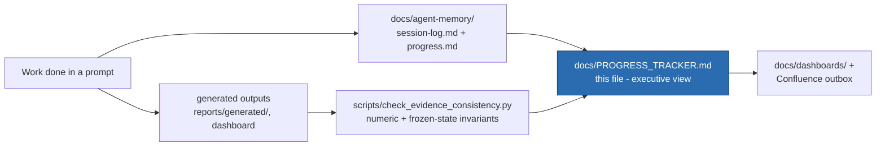

# VEGO-AI Progress Tracker

**Single-source, at-a-glance status.** For the full chronological log see `docs/agent-memory/progress.md`;
for the maintenance flow see §8. Auto regions are refreshed by `python scripts/build-progress-tracker.py`.

> **July 29 doctoral successor program (implemented 2026-07-30):** the active working authority is
> `docs/research/phd-proposal/`. It controls all 19 requirements, 15 actions, and 10 open questions and
> recommends one umbrella RQ plus three mapped subquestions/studies. The wording, Plan A/B labels, and study
> architecture remain pending Iris/Arnon approval. The August 5 pre-read is prepared but not recorded as sent.

> **Enhanced Iris requirements assurance (2026-08-01):** all 44 controls have call-time, evidence,
> presentation, and remaining-gate locators. Readiness remains 2 verified complete, 6 implemented awaiting
> human acceptance, 22 partial, 5 open, and 9 blocked. A deterministic preliminary ledger covers all 1,195
> machine segments (910 control-linked; 285 human-review placeholders), with a separate fail-closed Reviewer
> A/B and adjudication merger; segment and full-media human review remain 0/1,195 and 0/1 per reviewer. IRIS-EXP-01–10 now distinguish structure, readiness, and closure: structure passes, but readiness and
> closure remain non-zero until the required human/external evidence exists. The local August 5 package has a
> 12-slide core, nine-slide appendix, corrected PPTX/PDF, 21 source-note sections, review workbook, and visual QA; the prior backup is stale and awaits post-rehearsal freeze/rebuild;
> human rehearsal, Ali release approval, delivery, access tests, and supervisor acceptance remain open. It is
> not the candidacy deck. Submission closure requires a schema-valid receipt bound to the package, external
> receipt, authorization evidence, and issued certificate; the tracked template is `NOT_SUBMITTED`. No blanket
> “all requirements complete” claim is authorized.

> **Evidence and feasibility boundary:** the July 1 redirect and July 24 continuation are preserved as
> legacy/absorbed plans. EXP-005 remains at 0/24 and no improvement claim is authorized. Medical work is
> NO-GO at 0/6 entry gates; the MIMIC review was metadata-only and inspected no patient rows. If any critical
> medical prerequisite remains unproved on August 26, Plan B becomes the September proposal baseline.

<!-- AUTO:stamp:start -->
H-layer track state as of 2026-07-26 00:30 UTC (from `docs/research/h-layer/program-status-snapshot-v1.json`; this date does not move unless that snapshot is regenerated, and does not reflect the separate PhD-proposal track - for overall current project status see `docs/agent-memory/current-state.md`) · live branch, revision, and worktree state intentionally omitted · generated by `scripts/build-progress-tracker.py`
<!-- AUTO:stamp:end -->

---

## 1. Snapshot
<!-- AUTO:snapshot:start -->
> **Two tracks are active:** offline H-layer architecture/experiment advancement and the human-gated evaluation
> preparation. 15 H-layer iterations are accepted; 001-007 are historical/pre-manifest and 008-015 are manifest-backed. Iteration 015 is the latest `NEUTRAL` reliability-only snapshot. None selects a default.
> Until at least 20 generalization-safe labels exist, accuracy improvement cannot be evaluated.
<!-- AUTO:snapshot:end -->

<!-- AUTO:phases:start -->
| Phase | Status | % |
| --- | --- | ---: |
| A. Artifact build (M1→M4B-1) | ✅ Complete, merged, tagged | 100% |
| B. Inspection (dashboard + visualizer) | ✅ Complete, merged | 100% |
| C. Evaluation tooling (EXP-001…005 + harness + guard) | ✅ Complete | 100% |
| D. Annotation package (bias/leakage-controlled) | ✅ Ready to send | 100% |
| E. Thesis write-up | 🟦 10 / 10 chapters drafted | ~100% |
| F. Empirical evidence (expert labels → results) | 🟥 Blocked on human labeling | 0% |
<!-- AUTO:phases:end -->

### Label collection (the binding constraint)
<!-- AUTO:labels:start -->
`safe labels filled: 0 / 24` — need **≥20** before any quantitative claim (pilot at 1–19; blocked at 0). reviewer-1 0, reviewer-2 0, adjudicated 0.
<!-- AUTO:labels:end -->

---

## 2. Milestones (artifact)
| Milestone | What it delivers | Status |
| --- | --- | --- |
| M1 Human Review Queue (+M1.2 signature) | detect where human judgment is needed | ✅ merged |
| M2 Human Feedback Manager | schema-validated structured feedback | ✅ merged |
| M3 Human Judgment Memory | reusable, provenance-tracked judgment + explainable retrieval | ✅ merged |
| M4A Memory Advisory Layer | advice only; `ai_classification_changed=0` | ✅ merged |
| M4B-1 Memory-Informed Comparison | deterministic, non-destructive parallel comparison | ✅ merged |
| M4B-2 LLM reclassification | — | ⛔ blocked (out of scope) |

Stable tags: `official-vego-ai-baseline` · `research-state-m4a-clean` · `research-state-results-dashboard` ·
`research-state-m4b1-deterministic-comparison` · `research-state-visualizer-ux-clean`.

## 3. Experiments
| Exp | Purpose | Status | Key result |
| --- | --- | --- | --- |
| EXP-001 | mechanism/readiness eval | ✅ done | 27 rows, 0 changes, **0 safe labels** |
| EXP-002 | expert-labeling package | ✅ done | 27 rows, 24 safe candidates |
| EXP-003 | accuracy-improvement tooling + bias/leakage-controlled annotation package | ✅ tooling done | gate: *cannot be evaluated yet* |
| EXP-004 | policy-sensitivity (synthetic) | ✅ done | screening only, not evidence |
| EXP-005 | real-label gate + adjudication + κ | ✅ tooling done | 0 valid labels → gate closed |
| EXP-006–008 | observation contracts, dosage, trigger replay | iteration-009 repairs retained; iteration-014 reliability snapshot current | 481 captured/reconstructed + 20 explicit gaps = 501 contract records; Pareto/workload evidence only, no default |
| EXP-009/010 | H-Verify/convergence synthetic prototypes | provisional runs; protocol unapproved | assumption-driven, not real-expert validation |
| EXP-011 | V0/V1 evaluation | parked | architecture + labels + supervisor go-ahead required |
| EXP-012 | validated baseline interface | repaired / cross-check PASS | safe N=0 → `NOT YET COMPUTABLE`; no evidence claim |
| EXP-013–018 | architecture-conformance series | offline fixture runs + validator pass | scoped mechanism/safety evidence; atomic iteration acceptance separate |

The separate non-production `IRIS-EXP-01`–`IRIS-EXP-04` assurance series checks
requirements traceability, supervisor-presentation readiness, claim language,
and weekly change propagation. It does not extend the canonical scientific
experiment catalog or supply accuracy, generalization, effort, medical, or
supervisor-approval evidence.

## 4. Thesis (`thesis/chapters/`)
| Drafted (10) | Remaining quantitative completion |
| --- | --- |
| 1 Intro · 2 Related Work (verified cites) · 3 Problem/RQ · 4 Baseline · 5 Artifact · 6 Methodology · 7 Experimental Results/current evidence · 8 Threats · 9 Discussion · 10 Conclusion | **Chapter 7 quantitative accuracy/reliability sections** — need EXP-005 expert labels |

## 5. Gates & invariants (must stay true)
<!-- AUTO:invariants:start -->
| Invariant | Value | Checked by |
| --- | --- | --- |
| Tests passing | **113 passed _(dated verification record)_** | `pytest VEGO-AI/tests` |
| `ai_classification_changed` | **?** | dashboard / guard |
| baseline `eval_output` modified | **?** | guard |
| memory-informed differs from original | **0 / ?** | guard |
| generalization-safe expert labels | **0** | guard |
| deterministic policy | **v1 (no M4B-1.1 in code)** | guard |
| evidence consistency | **3/3 present checks passed PASS** | `scripts/check_evidence_consistency.py` |

Scale figures: **?** models · **?** patterns · **?** review items · **?** reusable judgments · **?** advice items.
<!-- AUTO:invariants:end -->

## 6. Critical path (what actually unblocks the thesis)
1. ⛔ **Supervisor approves** `docs/research/supervisor-label-approval-pack.md`: annotation protocol + reviewer panel + ethics/consent + claim boundary. *(owner: supervisor)*
2. ⛔ **Two experts label** the 24 blind rows (`reports/generated/exp003/annotation_package/blind_sheet_reviewer{1,2}.csv`). *(owner: experts)*
3. ⛔ **κ + adjudication** → freeze `gold_labels.csv`. *(owner: human)*
4. ▶️ **Run evaluation** on real labels → update **Chapter 7 quantitative results**. *(owner: agent, on request)*
5. ▶️ Only if errors warrant: design **M4B-1.1** on the 16 dev rows, test once on the sealed 8 holdout. *(owner: agent, after approval)*

Everything before step 4 is **human-gated for the evaluation track**. Offline architecture contracts, harness reliability, and conformance experiments may proceed without changing baseline behavior or selecting unapproved defaults.

### H-layer architecture/flow gates

1. Use `program-status-snapshot-v1.json` to keep the repository, thesis evidence view, and release PR aligned with accepted Iteration 15.
2. Record M-01..M-06; blank or ambiguous outcomes remain deferred and cannot become defaults.
3. Preserve iteration-009 metric semantics, the Iteration 14 replay snapshot, and Iteration 15 fail-closed parity; reliability hardening does not create accuracy evidence.
4. Keep live listeners, automatic correction, and model replacement blocked until their separate human and evidence gates are explicit.

## 7. Frozen / not allowed (until evidence + approval)
M4B-2 · Agent 4 changes · LLM/API calls · embeddings · policy v1.1 · baseline overwrite · any accuracy claim.

## 7b. Recent activity (latest session-log entries)
<!-- AUTO:activity:start -->
- 2026-09-06 00:19 +03:00 - Codex - AirTravel v4 authorization repair
- 2026-09-06 00:07 +03:00 - Codex - AirTravel v4 authorization repair
- 2026-09-05 00:32 +03:00 - Codex - Final pre-authorization consistency correction
- 2026-09-05 00:06 +03:00 - Codex - AirTravel v3.2.1 receipt completeness finalized
- 2026-09-05 00:04 +03:00 - Codex - AirTravel v3.2.1 final CI run recorded
- 2026-09-05 00:03 +03:00 - Codex - AirTravel v3.2.1 CI gate recorded
<!-- AUTO:activity:end -->

---

## 8. Tracking architecture & maintenance plan

How progress is produced and kept current (this tracker is the executive view on top of the detailed logs):

**Update rules**
- **Source of truth for detail:** `docs/agent-memory/progress.md` (chronological) + `session-log.md`. This
  tracker summarizes them — update it when a phase/milestone/experiment/chapter status changes, not for every edit.
- **Before any status/claim update:** run `python scripts/check_evidence_consistency.py` (must be PASS) so the
  invariants in §5 are real; never edit §5 by hand to a value the guard contradicts.
- **Cadence:** refresh §1 phase board + §5 invariants whenever the evidence baseline commit changes or a gate
  flips (e.g. first real expert labels arrive → Phase F moves off 0%, EXP-005 gate text changes).
- **Do not duplicate:** the deep dashboards/visualizations remain in `docs/dashboards/` and
  `docs/operations/progress-update-architecture.md`; this file links to them rather than copying them.
- **Owner column discipline:** keep §6 honest about *who* unblocks each step (supervisor / experts / agent) so
  it is always clear that the remaining critical path is human-gated.
