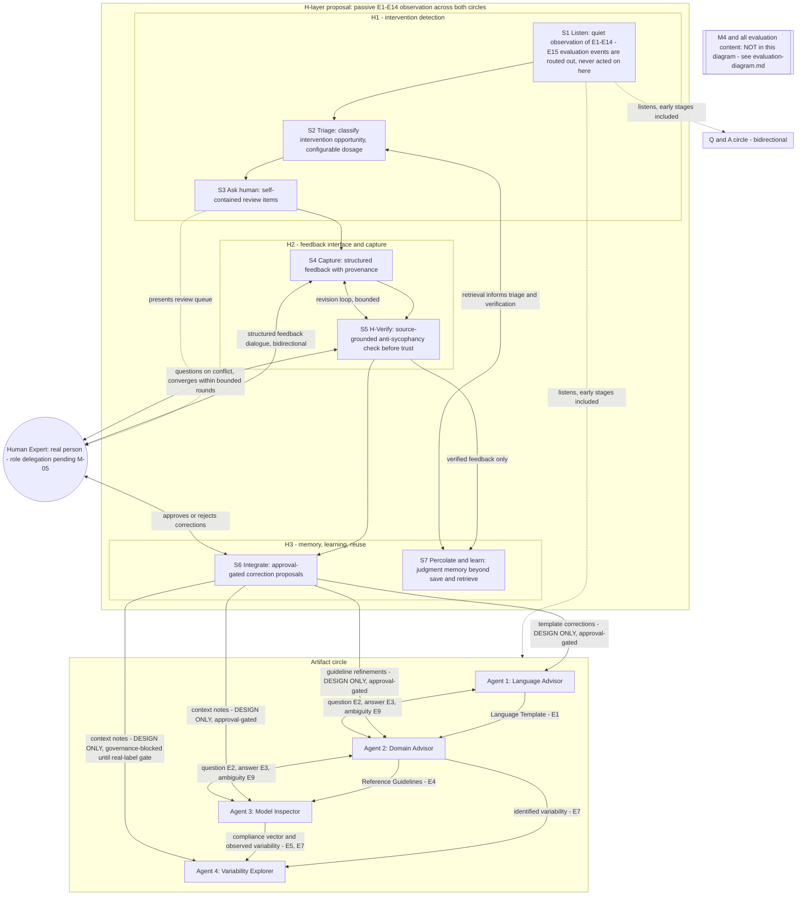

# VEGO-AI Framework Diagram - H-Layer (Human Judgment Layer)

Last updated: 2026-07-10. Status: **PROVISIONAL** until M-02 through M-05 outcomes are recorded.

This is the proposed FRAMEWORK view derived from the machine-generated 2026-07-01 meeting record (notes:
`docs/research/meetings/2026-07-01-supervisor-meeting-iris.md`): the four baseline agents, the two
communication circles, and a candidate H-layer. Full passive E1-E14 observation remains an M-03 choice;
E15 is evaluation-only. Skill definitions: `docs/research/h-layer/skills-map.md`.

**M4 / evaluation is NOT in this diagram.** Everything evaluation-related (M4A advisory, M4B-1 comparison,
EXP-001..EXP-005, Version 0 vs. Version 1, usability questionnaire) lives in
`docs/architecture/evaluation-diagram.md`, per the separate-diagrams directive.

**Terminology note (added 2026-08-31):** the H1/H2/H3 grouping and S1-S7 skill labels below predate the
2026-08-05 supervisor pivot to the SQ1 (selective intervention) / SQ2 (judgment representation and
governance) / SQ3 (reuse and transfer) research-question framing now current in
`docs/research/phd-proposal/three-study-contract.md`. The two framings describe closely related ideas
(H1↔SQ1, H2↔SQ2, H3↔SQ3) but have never been formally reconciled - this diagram has not been rewritten
in case the July H1/H2/H3 grouping still matters for the open agent-boundary decision below (section 6
of `docs/research/h-layer/skills-map.md`). Do not treat H1/H2/H3 and SQ1/SQ2/SQ3 as interchangeable
without checking that reconciliation has actually happened.

## Reading The Diagram

- Two circles (Iris, transcript 00:09-04:24): the artifact circle hands artifacts one-way between agents;
  the Q and A circle is bidirectional - asking can also cause the ANSWERING agent to refine its own
  artifact (E3 feeding E1).
- The working design proposes passive observation across both circles and limited active routing at early
  stages. Full coverage and routing policy remain M-03 decisions; this diagram does not authorize hooks.
- Verify-then-trust order: expert feedback flows S4 -> S5 -> S7/S6, so only source-verified judgments enter
  memory or become correction proposals. S5 is the anti-sycophancy step: it checks expert input against the
  agreed sources and raises questions on conflict instead of complying or contradicting, within bounded
  rounds (convergence directive).
- The human expert is a real person with a bidirectional interface (dialogue in S4/S5, approvals in S6);
  most H-layer interfaces are bidirectional per the meeting's arrow correction.
- Governance: S6 arrows into agents are correction proposals only. Timeout preserves baseline behavior and
  parks the item. Live hooks remain blocked by M-05 plus separate authorization; Agent 4 stays unchanged.

## Open Decision (2026-07-15 Meeting)

Whether the H-layer is deployed as (A) three agents matching H1/H2/H3, (B) an Observer agent (H1) plus an
Integrator agent (H2+H3) - the current recommendation - or (C) one agent with seven skill modules, is an
open decision analyzed in `docs/research/h-layer/skills-map.md` section 6. The grouping boxes above show
the H1/H2/H3 mapping, not final agent boundaries.
