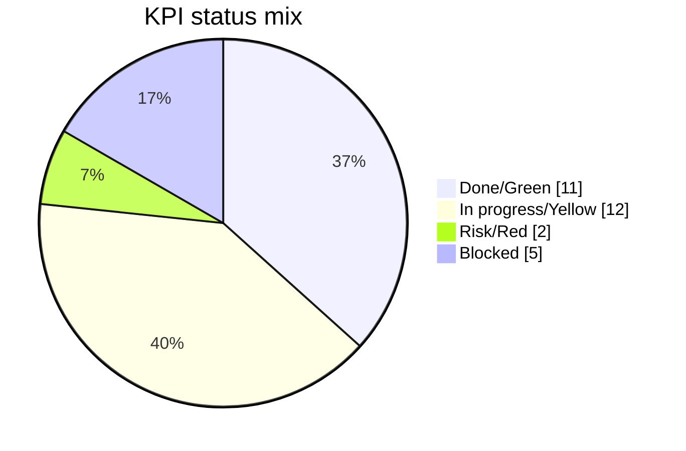
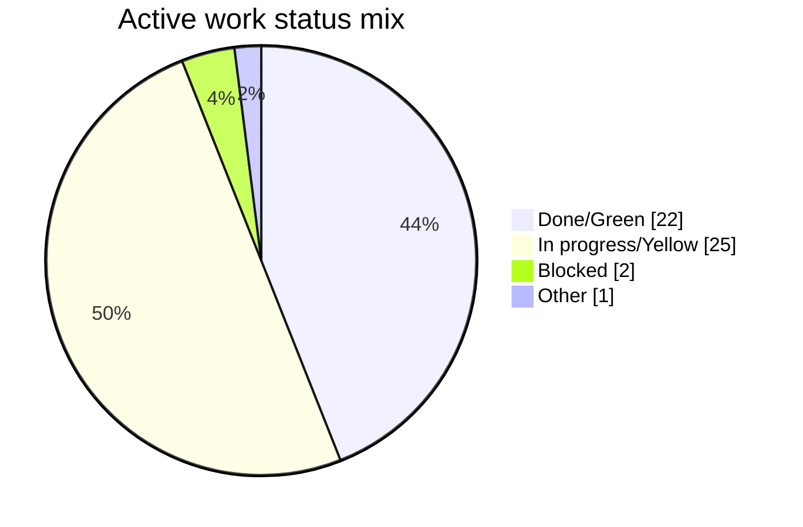
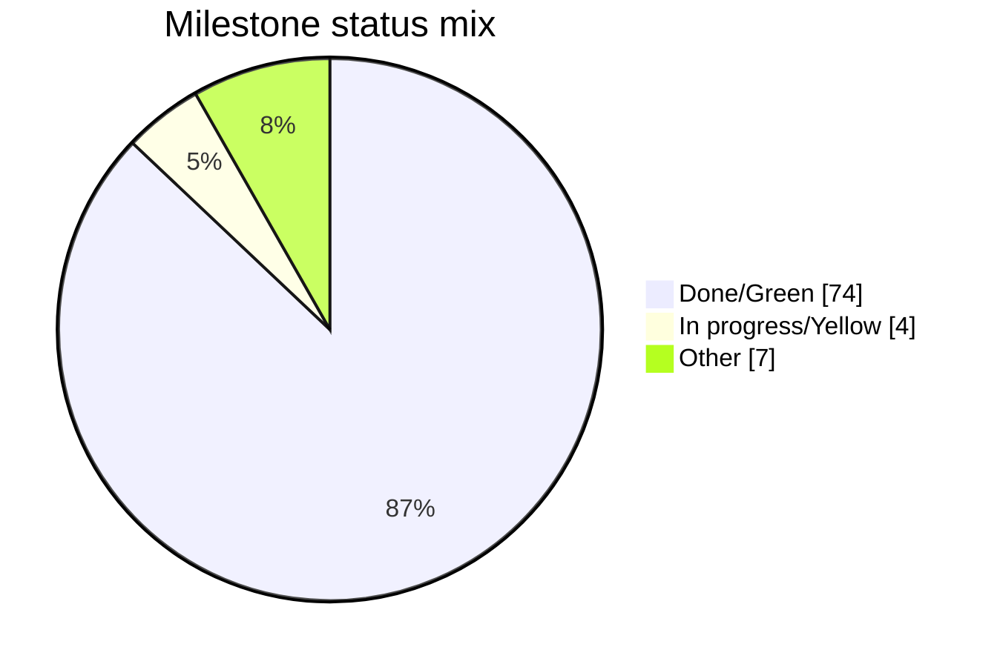
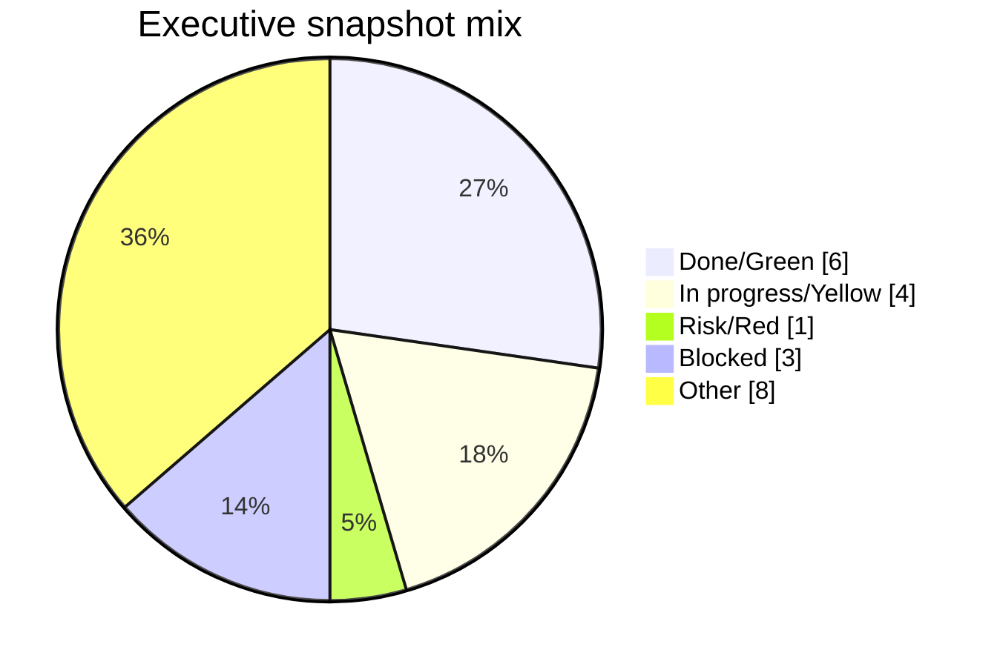
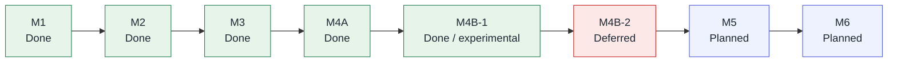
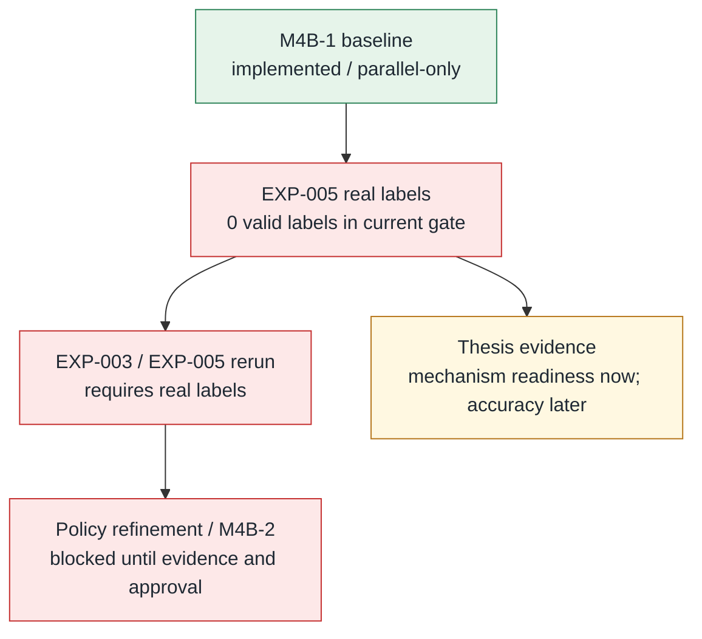
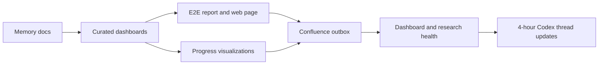

# VEGO-AI Progress Dashboard

Generated from repository memory on 2026-09-02 09:28 +03:00.

## Status Snapshot

# Dashboard Status Snapshot

Generated: 2026-09-02 09:28 +03:00.

This snapshot is generated by scripts/build-dashboard-snapshot.ps1 for local review and Confluence tracking. It is intentionally ignored by Git so the wiki can show fresh runtime status without creating timestamp-only commits.

## Repository State

| Field | Value |
| --- | --- |
| Branch | HEAD |
| Upstream | Unknown |
| HEAD | 8e2741f |
| Worktree | Pending changes |
| Milestone/research tags | 7 |

## KPI Rollup

| Source | Rollup |
| --- | --- |
| docs/dashboards/kpi-register.md | Green 11, Yellow 12, Red 2, Blocked 5 |
| docs/agent-memory/progress.md active work | Blocked 1, Open 12, In progress 2, Done 17, Other 4 |

## Confluence Tracking

| Field | Value |
| --- | --- |
| Generated outbox | Present |
| Configured page IDs | 0 of 5 |
| Live sync state | Local config missing |

## Outbox Pages

| Page Body | State |
| --- | --- |
| vego-ai-wiki-home.md | Ready |
| vego-ai-current-state.md | Ready |
| vego-ai-progress-dashboard.md | Ready |
| vego-ai-update-changelog.md | Ready |
| vego-ai-research-operations.md | Ready |

## Follow-Up

- If outbox pages are missing, run .\scripts\build-confluence-wiki.ps1.
- If live page IDs are missing, grant Atlassian Rovo access and create/update child pages under Confluence page 294914.
- If the worktree shows pending changes, commit safe tracked docs/scripts after forbidden-artifact audit.


## Progress Dashboard

# Progress Dashboard

Last curated update: 2026-08-01.

## Executive Snapshot

The July 29 requirements-closure program is the current working authority, subject to bilingual and supervisor confirmation. All 19 requirements, 15 actions, and 10 open questions are controlled. A deterministic preliminary ledger accounts for all 1,195 machine segments, but bilingual/speaker review and adjudication remain 0/1,195. The recommended one-plus-three architecture, three studies, Plan A/B, proposal `v0.1`, and August 5 pre-read remain unapproved and unsent. The August 5 supervisor package is built locally as a 12-slide English core plus nine-slide appendix, with 21/21 source-note sections, corrected PPTX/PDF, visual QA, and review workbook; the previous offline ZIP is stale and must be rebuilt after rehearsal/freeze. Human rehearsal, Ali release approval, delivery, access tests, and supervisor decisions remain open. Medical readiness is NO-GO at 0/6 gates, and EXP-005 remains 0/24, so no accuracy, generalization, or clinical-performance gain is claimed.

Run `.\scripts\build-progress-visualizations.ps1` for generated Mermaid status charts and a local HTML progress dashboard at `docs/dashboards/progress-visualizations.generated.html`.
Run `.\scripts\build-e2e-progress-report.ps1` for the full E2E progress report and local web page at `reports/generated/e2e_dashboard/index.html`.

| Area | Status | Evidence | Next Action |
| --- | --- | --- | --- |
| July 29 doctoral control package | Yellow / awaiting supervisor decisions | `docs/research/phd-proposal/`: 19/15/10 master register, exact one-plus-three RQ recommendation, three-study contract, legacy crosswalk, claim/RACI/RAID registers, proposal `v0.1`, and August 5 pre-read. | Ali reviews the exact package; Iris and Arnon decide the RQs, studies, Plan A/B, owners, literature categories, and dates. |
| July 29 call extraction and assurance | Structure green / human gates blocked | S-0001–S-1195 preliminary CSV/JSON and review workbook; 910 machine-linked rows, 285 human-review placeholders; separate Reviewer A/B and third-person merge interface; IRIS-EXP-01–10 validator. | Complete both 1,195-segment reviews plus one full-media record per reviewer and adjudicate every disagreement; readiness/closure remain non-zero meanwhile. |
| August 5 supervisor presentation | Local construction and automated/render QA green; human delivery readiness yellow | 21-slide PPTX/PDF, 21/21 source-note sections, 44/44 control reachability, 21/21 PowerPoint-native renders inspected; previous backup invalidated. | Ali reviews the exact package; run timed and adversarial human rehearsals; rebuild/freeze the backup; then authorize delivery and record Iris/Arnon access tests. |
| Private Drive and literature workbook | Green for initial structure; sharing/search pending | Ali-owned nine-folder Drive and native six-tab Sheet are recorded in `drive-workspace-manifest.md`; no external share or completed search is claimed. | Ali authorizes exact recipients, then execute and log database searches and screening. |
| Medical readiness and MIMIC audit | Blocked / 0 of 6 gates | `medical-readiness-scorecard.md` and metadata-only audit: 25 CSVs, 39.65 GiB, missing `NOTEEVENTS`, no patient-row inspection. | Collect all six prerequisite proofs; default to Plan B on August 26 if any critical gate remains open. |
| July 1 redirect and July 24 continuation | Legacy / absorbed | Both files retain their evidence and safety gates but point to the July 29 successor program. | Use the legacy RQ and decision crosswalks; do not treat older plans as active authority. |
| Phase 0 truth/governance reconciliation | Complete | `docs/research/h-layer/phase-0-boundary-record.md`; source reconciliation, generated memory/wiki refreshes, focused tests, and protected-path checks pass. | Preserve unrelated changes and keep runtime work gated by recorded authorization. |
| Offline experiment program | Yellow / gated | Ten accepted iterations; iteration 009 repairs contracts/metrics, iteration 010 is a reliability-only rerun, and the separate conformance suite passes offline. | Preserve the six-experiment replay contract; keep iteration 011 and live integration blocked until their gates clear. |
| Passive shadow listener | Blocked | `allowed-touch-proposal.md` and template are proposals only. | Require M-05 plus separate exact-file authorization; default-off/fail-open if later approved. |
| MediVARIA PhD-track study plan | Conditional Plan A proposal | `docs/research/medivaria/medivaria-study-plan.md`: clinical transfer mapping and legacy questions; no clinical-performance evidence exists. | Crosswalk to SQ3 and keep operational work blocked until the six medical gates pass. |
| Source baseline | Documentation branch; production unchanged | Branch `docs/iris-july29-phd-execution`; ten July 29 evidence artifacts preserved in commit `3d0beca`. | Stage only intended research, tracking, and generated documentation paths; verify protected behavior remains untouched. |
| M1 Human Review Queue | Green | Implemented and tested. | Use as upstream evidence for artifact manifest. |
| M2 Human Feedback Manager | Green | Implemented and tested. | Include schema/docs/tests in artifact manifest. |
| M3 Human Judgment Memory | Green | Tag `milestone-m3-human-judgment-memory`. | Reference tag in thesis evidence. |
| M4A Memory Advisory Layer | Green | Tag `milestone-m4a-memory-advisory`. | Include advisory-only proof in manifest. |
| M4B-1 Memory-informed parallel comparison | Historical implementation / evaluation pending | Historical merge `944c922`; tag `research-state-m4b1-deterministic-comparison`. | Keep as evaluation history; do not infer current worktree cleanliness or improvement. |
| Visualizer model/result matching | Green | PR #7 real-display validated, merged as `78b261e`, tag `research-state-visualizer-ux-clean`. | Preserve no-silent-mismatch and read-only research-panel boundaries. |
| EXP-001 evaluation | Yellow | Initial mechanism/readiness run generated ignored `reports/generated/exp001/` tables. | Add held-out or cross-setting expert labels before accuracy/generalization claims. |
| EXP-002 expert labeling package | Yellow | Ignored `reports/generated/exp002/` package generated: 27 rows, 24 generalization-safe candidates, 3 existing same-pattern labels. | Human/supervisor labels should fill at least 20 rows, preferably all 27 current rows. |
| Dashboard/wiki tracking gate | Historical pass / refresh needed | Runtime snapshot and manual sync pack exist; curated dashboard sources changed on 2026-07-10. | Announce generated-file refreshes, rebuild the outbox, then rerun `dashboard-health -RequireOutbox`. |
| Data/IRB audit | Red | Controlled artifacts still ignored and metadata-only. | Continue audit before sharing artifacts. |
| Confluence live tracking | Blocked | Outbox/manual sync pack exists; Atlassian Rovo cloud access not explicitly granted as of 2026-06-14 14:50 +03:00; Chrome extension fallback unavailable as of 2026-06-13 13:50 +03:00. | Grant Rovo access or enable the Chrome extension route, then create/update child pages. |

## Milestone Flow

| Milestone | Research Meaning | State | Anchor |
| --- | --- | --- | --- |
| M1 | Human judgment is selectively triggered. | Done | Human Review Queue docs/tests. |
| M2 | Human decisions are structurally captured. | Done | Human Feedback Manager docs/tests. |
| M3 | Human judgment is stored as reusable memory. | Done | `milestone-m3-human-judgment-memory`. |
| M4A | Reusable judgment is retrieved as advisory evidence. | Done | `milestone-m4a-memory-advisory`. |
| M4B-1 | Memory advice may inform a deterministic parallel comparison. | Done / experimental | `research-state-m4b1-deterministic-comparison`; EXP-001 evaluation still pending. |
| M4B-2 | Optional LLM/Agent 4 mode. | Deferred | Not approved. |
| M5 | Human-approved guideline refinement. | Planned | Roadmap. |
| M6 | Evaluation and thesis synthesis. | Planned | Evaluation plan and thesis outline. |

## Immediate Work Queue

| Priority | Work Item | Owner | Status |
| --- | --- | --- | --- |
| P1 | Review the exact August 5 package before any external share. | Ali | Human review |
| P1 | Decide RQ wording, three-study map, Plan A/B labels, medical owner, literature categories, Penina dates, and administrative owner. | Iris, Arnon, Ali | Awaiting August 5 |
| P1 | Record decisions and proposal deltas within 24 hours. | Ali | Awaiting decisions |
| P1 | Execute reproducible literature searches, deduplication, screening, identity/claim verification, and synthesis. | Ali | Ready to start |
| P1 | Obtain written official candidacy-process and deadline confirmation. | Department / Graduate Studies owner | Open |
| P1 | Maintain medical NO-GO at 0/6 and prepare the August 26 fallback review. | Ali + named gate owners | Blocked |
| P1 | Complete bilingual/speaker review before quotations or final attribution. | Ali + bilingual reviewer | Open |
| P1 | Approve EXP-005 protocol and schedule two human reviewers; never prefill labels. | Supervisors / research lead | Human-gated |
| P2 | Refresh project memory, dashboards, local wiki outbox, and health evidence after each tranche. | Codex / Claude | Active rule |

## Confluence Tracking

The generated Confluence outbox should include a dashboard page sourced from:

- `docs/dashboards/status-snapshot.generated.md` (ignored runtime snapshot)
- `docs/dashboards/progress-visualizations.generated.md` (ignored generated visual summary)
- `docs/dashboards/e2e-dashboard.generated.md` (ignored generated E2E report)
- `docs/dashboards/progress-dashboard.md`
- `docs/dashboards/kpi-register.md`
- `docs/dashboards/results-dashboard.md`

Until live Confluence access is granted, `docs/confluence/outbox/` is the pending wiki update.
`docs/confluence/manual-sync-pack.generated.md` is the ignored fallback publishing package with the same curated page bodies and hashes.


## Progress Visualizations

# Progress Visualizations

Generated: 2026-09-02 09:28 +03:00.

This generated dashboard summarizes docs/agent-memory/progress.md, docs/dashboards/progress-dashboard.md, and docs/dashboards/kpi-register.md. Regenerate it with .\scripts\build-progress-visualizations.ps1.

## Summary Cards

| Signal | Value | Visual |
| --- | --- | --- |
| Milestone completion | 74 of 85 done/green | [#################---] 87% |
| KPI green rate | 11 of 30 green | [#######-------------] 37% |
| Active work closed | 22 of 50 done | [#########-----------] 44% |
| Executive snapshot green | 6 of 22 green | [#####---------------] 27% |

## KPI Status Mix



## Active Work Status Mix



## Milestone Status Mix



## Executive Snapshot Mix



## Milestone Timeline



## Evidence Gate Flow



## EXP-005 Gate

> Current generated verdict is blocked: 27 rows, 24 safe candidates, 0 supplied labels, 0 valid labels, 0 safe labels.

## Open Active Work

| ID | Status | Summary | Next Step |
| --- | --- | --- | --- |
| TASK-003 | Open | Audit data sensitivity and provenance. | Review `VEGO-AI/inputs/`, `[controlled case-model path omitted]`, `[controlled analysis path omitted]`, and the IRB-related PDF. |
| TASK-004 | In progress | Map existing paper/package results to experiments. | Continue `EXP-000-existing-packaged-results-audit` without copying controlled artifacts into Git. |
| TASK-005 | Blocked | Keep curated Confluence wiki current. | Grant Atlassian Rovo access to cloud `724252a1-a5b7-45a5-b6ec-27a8292197ec`, then create/update child pages and store page IDs in local config. |
| TASK-008 | Open | Keep progress, KPI, and results dashboards current. | Update `docs/dashboards/` whenever progress, KPI values, validated results, or Confluence tracking status changes. |
| TASK-009 | Open | Keep dashboard/wiki tracking health verified. | Run `.\scripts\dashboard-health.ps1 -RequireOutbox` after every Confluence outbox build. |
| TASK-010 | Open | Keep runtime dashboard snapshot fresh. | Run `.\scripts\build-confluence-wiki.ps1` after memory/dashboard updates; it regenerates `docs/dashboards/status-snapshot.generated.md`. |
| TASK-011 | Open | Keep manual Confluence sync pack fresh while live access is blocked. | Run `.\scripts\build-confluence-wiki.ps1`; it regenerates `docs/confluence/manual-sync-pack.generated.md`. |
| TASK-016 | Open | Complete EXP-001 expert-label evaluation. | Add held-out/cross-setting expert labels, rerun `.\scripts\build-exp001-evaluation.ps1`, and update the evaluation report with generalization-safe metrics. |
| TASK-017 | Open | Fill EXP-002 expert labeling package. | Human/supervisor should label at least 20 rows, preferably all 27 current rows, then rerun evaluation with leakage-aware partitions. |
| TASK-019 | Open | Collect EXP-003 independent expert labels. | Fill the blind/full EXP-003 sheets with at least 20 generalization-safe labels before any accuracy-improvement claim or M4B-1 policy refinement. |

## Generated HTML

Open docs/dashboards/progress-visualizations.generated.html locally for the card-and-bar version.


## E2E Progress Report

# VEGO-AI E2E Progress Report

Generated: 2026-09-02 09:28 +03:00.

This generated report connects repo memory, curated dashboards, generated experiment summaries, Confluence outbox status, and the 4-hour update loop. Regenerate it with `.\scripts\build-e2e-progress-report.ps1`.

## Executive Status

| Signal | Value | Visual |
| --- | --- | --- |
| Milestones done/green | 74 of 85 | [#################---] 87% |
| KPIs green | 11 of 30 | [#######-------------] 37% |
| Active work done | 22 of 50 | [#########-----------] 44% |
| Executive dashboard green | 6 of 22 | [#####---------------] 27% |
| Review verdict | not generated | Next action: Run .\scripts\run-project-review.ps1 -UpdateReviewState. |
| Git workspace | HEAD @ 8e2741f | 13 pending status rows |

## E2E Evidence Snapshot

| Area | Current Value | Gate |
| --- | --- | --- |
| VEGO runtime snapshot | 0 settings, 0 cases, 0 variability patterns | Baseline AI classification changes: 0 |
| Human judgment chain | 0 review queue items, 0 reusable memory entries, 0 advice items | M4A/M4B-1 remain non-destructive |
| EXP-001 | 0 comparisons, 0 memory-informed classification changes, 0 safe expert labels | Mechanism/readiness only |
| EXP-002 | 0 labeling rows, 0 safe candidates | Human/supervisor labels pending |
| EXP-003 | 0 rows, 0 safe labeled rows | Unavailable |
| EXP-005 | 0 rows, 0 safe candidates, 0 supplied labels, 0 safe valid labels | Unavailable |

## Update Architecture



## Current Blockers

- No generated review blockers found.

## Open Active Work

| ID | Status | Summary | Next Step |
| --- | --- | --- | --- |
| TASK-003 | Open | Audit data sensitivity and provenance. | Review `VEGO-AI/inputs/`, `[controlled case-model path omitted]`, `[controlled analysis path omitted]`, and the IRB-related PDF. |
| TASK-004 | In progress | Map existing paper/package results to experiments. | Continue `EXP-000-existing-packaged-results-audit` without copying controlled artifacts into Git. |
| TASK-005 | Blocked | Keep curated Confluence wiki current. | Grant Atlassian Rovo access to cloud `724252a1-a5b7-45a5-b6ec-27a8292197ec`, then create/update child pages and store page IDs in local config. |
| TASK-008 | Open | Keep progress, KPI, and results dashboards current. | Update `docs/dashboards/` whenever progress, KPI values, validated results, or Confluence tracking status changes. |
| TASK-009 | Open | Keep dashboard/wiki tracking health verified. | Run `.\scripts\dashboard-health.ps1 -RequireOutbox` after every Confluence outbox build. |
| TASK-010 | Open | Keep runtime dashboard snapshot fresh. | Run `.\scripts\build-confluence-wiki.ps1` after memory/dashboard updates; it regenerates `docs/dashboards/status-snapshot.generated.md`. |
| TASK-011 | Open | Keep manual Confluence sync pack fresh while live access is blocked. | Run `.\scripts\build-confluence-wiki.ps1`; it regenerates `docs/confluence/manual-sync-pack.generated.md`. |
| TASK-016 | Open | Complete EXP-001 expert-label evaluation. | Add held-out/cross-setting expert labels, rerun `.\scripts\build-exp001-evaluation.ps1`, and update the evaluation report with generalization-safe metrics. |
| TASK-017 | Open | Fill EXP-002 expert labeling package. | Human/supervisor should label at least 20 rows, preferably all 27 current rows, then rerun evaluation with leakage-aware partitions. |
| TASK-019 | Open | Collect EXP-003 independent expert labels. | Fill the blind/full EXP-003 sheets with at least 20 generalization-safe labels before any accuracy-improvement claim or M4B-1 policy refinement. |
| TASK-020 | Open | Use EXP-004 to screen policy candidates after real labels exist. | Rerun `.\scripts\build-policy-sensitivity-simulation.ps1` after EXP-003 has real labels; treat current synthetic results as pipeline/risk screening only. |
| TASK-021 | Open | Collect EXP-005 supervisor/expert labels through the real-label gate. | Fill `reports/generated/exp005_label_review/exp005_label_review_blind.csv`, then run `.\scripts\build-exp005-label-review.ps1 -FilledLabelsSheet <filled-sheet> -RunDownstream`. |

## Open Issues

| ID | Severity | Status | Summary | Next Step |
| --- | --- | --- | --- | --- |
| ISS-049 | Medium | Resolved in the wave-1 PR; process gap still open | PR #32 ("Complete documentation structure...") edited the protected-tree file `VEGO-AI/eval/README_EVALUATOR.md` without updating `CURRENT_RUNTIME_LOCKS` in `scripts/build_hardening_manifests.py`, and was merged while its CI run concluded FAILURE - leaving `main` red on the hardening check. Repaired in the wave-1 branch by re-locking the README's hash (content diff reviewed: docs-only, no runtime change) and regenerating the manifests. Process gap: nothing prevents merging a red PR; this is the second time a red merge reached `main` (see the 2026-08-24 pip-audit incident). | Consider branch protection requiring the merge-gate check on `main`, and a rule that any protected-tree edit must update the lock table in the same PR. |
| ISS-048 | Medium | Open, specification tension needing a decision | `schemas/governed-judgment-record-v1.schema.json` ships SEVEN lifecycle states, not the six `chapter-4-research-methodology.md` §4.4 fixes (`Draft, Active, Contested, Superseded, Expired, Revoked`). It adds `retained_dissent`, and conformance check CHK-14 makes that state mandatory whenever a qualified dissent is unadjudicated - so the seventh state is forced, not optional. This is not schema sloppiness; it is a real tension in the specification: §4.4 fixes six states, while §3.4 requires retained dissent to be a state that BLOCKS REUSE pending adjudication, and `Contested` is not defined tightly enough to say whether it carries that blocking semantics. The deviation is documented in the audit report rather than hidden. | Decide one of: (a) update §4.4 to seven states, or (b) collapse `retained_dissent` into `Contested` and attach the reuse-blocking rule there. Until decided, do not describe the contract as implementing "the six-state lifecycle". See `docs/research/phd-proposal/architecture-alignment-audit-2026-08-31.md` §5. |
| ISS-047 | Low | Open, design questions for supervisor | Two design gaps in the new contracts, left deliberately unfixed. (1) `schemas/reuse-decision-record-v1.schema.json`'s context-distance ladder has no dimension for a *revised domain description*, though the proposal's p.9 sequence names it as a distinct step; it currently rides on `cohort`, so a mid-semester revision within one cohort computes differing-rank 1 and returns plain "Eligible" with nothing recording that the prior ruling's premise changed - the proposal's own failure mode reappearing inside the fix. Adding a rank changes every downstream comparison and the ladder is explicitly pending supervisor confirmation, so it was not changed unilaterally. (2) `schemas/review-policy-signal-contract-v1.schema.json`'s `importantCaseLabelIndependentOfPolicy` is a required boolean with no not-applicable state, so when `importantCaseLabelSource` is `not_yet_established` an instance must assert `true`/`false` about a label that does not exist; its two sibling fields solve this with `not_yet_*` enum members. | Put the revised-description ladder rank to Iris/Arnon with the mid-semester example; make the boolean nullable or a three-value enum. See `docs/research/phd-proposal/architecture-alignment-audit-2026-08-31.md` §6. |
| ISS-046 | Medium | Open | `format: "date-time"` is inert across every schema in `schemas/`. `rfc3339-validator` is not installed in the `uv` environment, so `jsonschema.FormatChecker()` registers no `date-time` checker and a timestamp of `"not-a-timestamp"` still passes `scripts/validate_research_records.py`. Verified by direct mutation test. This is repo-wide, not specific to the three contracts added on 2026-08-31. | Add `rfc3339-validator` to the dependency set and re-run the full example suite - expect previously-passing records to fail, so treat it as its own change with a cascade check, not a drive-by fix. |
| ISS-045 | Medium | Open | `experiments/registry.md` rows EXP-016 ("Authority and timeout safety") and EXP-035 ("Fault injection and authority safety") use "authority" to mean role-based access control over runtime writes on `SYNTHETIC_NOT_HUMAN` fixtures (`scripts/hlayer_offline/exp016.py` `ROLE_AUTHORITY` maps four roles onto `{submit_feedback, adjudicate, approve_correction}` with no claim, fragment, or scope term). The proposal's C2/§3.4 sense of "authority" is claim-specific standing to settle a particular contested fragment. A reader scanning the registry will read the proposal's construct as covered when it is not. | Relabel both rows to say "role-based action authorization" and add a one-line note distinguishing them from claim-specific authority; see `docs/research/phd-proposal/architecture-alignment-audit-2026-08-31.md` §2. |
| ISS-044 | High | Open, needs signed H-layer change authorization | Three verified live defects in `VEGO-AI/framework/human_judgment_memory.py` and `memory_advisor.py`, each contradicting a C2/C3 lifecycle requirement. (1) `write_memory()` dedups by `memory_id` keep-first, and `memory_id` is `f"HJM-{setting}-{pid}"` (setting+pattern only, not content or version), so an amended judgment for the same pattern collides with its predecessor and is silently dropped - the inverse of supersession. (2) `search_memory()` gates on `conflict_status == "needs_adjudication"` but never reads `status`, so a retired record still flows downstream, and takes no requester parameter, so the proposal's first reuse gate (visibility/authorization before exposure) is unimplementable at that call site. (3) `applies_to_future_models` appears exactly once in the whole framework - written as `False` in `build_memory_item()` - and is never read; `memory_advisor.py` forwards `reuse_scope` as only `{domain, diagram_type}`, dropping both `applies_to_future_models` and `limitations`. A default-deny reuse-scope control that nothing consults. | These files are under `VEGO-AI/framework/`, protected by `scripts/check_hlayer_change_authorization.py`; fixing them needs a signed authorization hash. Raise with Ali, then fix under that authorization. See the audit report §4. |
| ISS-043 | High | Open, needs a supervisor decision not an implementation | The construct the 2026-08-25 proposal §1.8 designates as the thesis's falsifiable novelty - reviewer selection as a function of claim-specific *competence* and *authority*, modelled as distinct dimensions - has no implementation surface, and `competence` is absent from the project's own design documents as well: `chapter-4-research-methodology.md` §4.4's field list names case grounding, system reasoning, expert rationale, scope, authority, provenance, and lifecycle, but not competence. It is the only §3.4 content element that is undesigned as well as unimplemented. What exists (`ROLE_AUTHORITY`, `ReviewItem.owner_role`, `gold-label-record-v2.reviewerRole`) is aggregate role over an action class, checked after submission - verbatim the form §1.8 names as the literature's insufficient version. Consequence: §3.3's declared primary test for Study 1 cannot be run as specified, since one of its five literature-derived signals has nothing to log, weight, or ablate. This PR adds `schemas/review-policy-signal-contract-v1.schema.json` modelling the two dimensions separately, but the construct itself needs supervisor confirmation before it can be treated as settled. | Put the competence construct to Iris/Arnon explicitly: is claim-specific competence assessment in scope, and how is it evidenced? See `docs/research/phd-proposal/architecture-alignment-audit-2026-08-31.md` §2. |
| ISS-042 | Low | Open, needs a decision not a guess | `docs/PROGRESS_TRACKER.md`'s `AUTO:stamp` region reads its "as of" date from `docs/research/h-layer/program-status-snapshot-v1.json`'s own `generatedAt` field (by design - deterministic, not wall-clock), which is `2026-07-26`. That file has no dedicated regenerator script in `scripts/` (only consumers), only one version (`v1`) exists, and no decision record says whether it is an intentionally-frozen snapshot of the now-paused/concluded H-layer experimental track, or a live feed that stopped being regenerated by mistake. Until this call is made, the stamp's wording has been changed (this PR) to state its H-layer-only scope explicitly and point to `docs/agent-memory/current-state.md` for overall project freshness, so it no longer reads as a whole-project staleness signal - but the underlying question of whether `program-status-snapshot-v1.json` should ever get a `v2` is still open. | Ali/Iris/Arnon (or a future agent with the H-layer meeting history in context) decides: freeze-and-document it as historical, or specify what should trigger a `v2` regeneration. |

## Approved Claims


## Blocked Claims


## Refresh Commands

```powershell
.\scripts\build-e2e-progress-report.ps1
.\scripts\build-progress-visualizations.ps1
.\scripts\build-confluence-wiki.ps1
.\scripts\dashboard-health.ps1 -RequireOutbox
.\scripts\research-health.ps1
.\scripts\project-health.ps1
```

## Generated Web Page

Open `reports/generated/e2e_dashboard/index.html` for the full local web dashboard.


## KPI Register

# KPI Register

Last curated update: 2026-08-01 by Codex. Dated implementation/test rows remain historical until rerun; this tranche changes research documentation, assurance interfaces, and presentation artifacts, not production VEGO-AI behavior.

## Status Legend

| Status | Meaning |
| --- | --- |
| Green | On track or verified. |
| Yellow | In progress or needs follow-up. |
| Red | At risk and needs active work. |
| Blocked | Waiting for external access or decision. |

## KPI Snapshot

| KPI | Current Value | Target | Status | Evidence | Next Action |
| --- | --- | --- | --- | --- | --- |
| July 29 control traceability | 19/19 requirements, 15/15 actions, and 10/10 open questions appear exactly once with owner, due date/gate, evidence, and acceptance check. | Maintain 44/44 controlled items with no ownerless open item. | Green | `docs/research/phd-proposal/master-traceability-register.md` | Update item status and evidence after each decision or completed action; never silently remove an item. |
| July 29 machine-to-review coverage | 1,195/1,195 segments are present in deterministic CSV/JSON and workbook interfaces; 910 are machine-linked to existing controls and 285 are conservative human-review placeholders. Separate Reviewer A/B and adjudication inputs are ready, but human review is 0/1,195 plus 0/1 full-media record per reviewer and no adjudicated output exists. | 1,195/1,195 independently reviewed and adjudicated, full 46:26.283 review evidenced, zero uncategorized segments, and zero orphan substantive clauses. | Blocked | `docs/research/meetings/2026-07-29-iris-zoom-human-review-workflow.md`, IRIS-EXP-05/06 | Assign Reviewer B and adjudicator; complete both full-call returns and full-media records; resolve every disagreement before quotation or certain named attribution. |
| August 5 presentation assurance | Local 12+9 slide PPTX/PDF built; 21/21 source-note sections, 44/44 control reachability, and 21/21 native renders inspected. Human rehearsal, Ali approval, delivery, and recipient access remain unproved. | Exact frozen package passes timed/adversarial human rehearsal, Ali approves sharing, and Iris plus Arnon independently pass access tests. | Yellow | `docs/research/meetings/2026-08-05-supervisor-presentation-manifest.md`, IRIS-EXP-08 | Run human rehearsals and defect rerun; share only after Ali approval; capture delivery and two access-test records. |
| Research architecture | Exactly one recommended umbrella RQ and three mapped subquestions/studies are documented; supervisor approval is pending. | Iris and Arnon approve or revise the hierarchy, with every legacy RQ disposition retained. | Yellow | `2026-08-05-rq-decision-pack.md`, `three-study-contract.md`, `legacy-rq-crosswalk.md` | Record the August 5 decision and propagate it within 24 hours. |
| Literature operating system | Private native six-tab Sheet with six seeded records, controlled lists, separate authors/researcher fields, and recorded protocol exists; searches are not executed. | Reproducible queries, verified identities, deduplication, screening reasons, taxonomy coverage, and critical synthesis. | Yellow | `drive-workspace-manifest.md`, `literature-review-protocol.md` | Run the databases and record real counts/dates; do not treat tools or unverified candidates as research evidence. |
| Medical readiness | 0/6 mandatory entry gates passed; no row-level work authorized. | 6/6 evidenced and approved before any patient/event/encounter row is inspected. | Blocked | `docs/research/governance/medical-readiness-scorecard.md` | Collect use-case, people, authorization, ethics/privacy, environment, and protocol proof; apply August 26 Plan B fallback. |
| Supervision cadence | Ali, Iris, and Arnon accepted the Wednesday 09:00-10:00 Asia/Jerusalem recurring event through the October 7 occurrence. | Accepted recurring cadence and evidence-led weekly pre-read/decision cycle. | Green | Calendar verification recorded in proposal package | Ali reviews the exact pre-read before it is sent; record decisions within 24 hours. |
| July 29 transcript review | 1195 Hebrew and bilingual segments are preserved as machine-derived working evidence; bilingual/speaker review is pending. | Human-reviewed language and attribution before quotations or final external release. | Yellow | July 29 meeting evidence package and `ISS-022` | Complete bilingual and diarization review; use paraphrases meanwhile. |
| Research spine clarity | Reusable human judgment is the explicit MSc/PhD research spine. | Research docs, roadmap, thesis outline, and claim/evidence table stay aligned. | Green | `docs/research/research-plan.md`, `thesis/outline.md` | Keep M4B design tied to reusable human judgment. |
| Implemented co-reasoning milestone | M1, M2, M3, M4A, and M4B-1 are implemented; M4B-1 remains experimental/parallel-only. | EXP-001/C4B evidence before any improvement claim; no M4B-2. | Green | Tags `milestone-m3-human-judgment-memory`, `milestone-m4a-memory-advisory`, `research-state-m4b1-deterministic-comparison`; `docs/research/m4b-conditional-approval.md` | PR #6 schema hardening merged; prepare controlled evaluation. |
| Test suite health | Historical 93-test pass; not rerun for the current dirty worktree. | All tracked tests pass before publishing. | Yellow | `python -m pytest VEGO-AI\tests -q` on 2026-06-14 after PR #7 merge | Rerun before reporting a current count or after authorized runtime work. |
| Compile health | Historical compile pass; not rerun for the current dirty worktree. | `compileall` passes for tracked Python implementation areas. | Yellow | Dated 2026-06-14 command in the results dashboard | Rerun after authorized runtime work. |
| Dashboard tracking health | Historical pass; current curated sources changed. | `dashboard-health` passes after wiki outbox build. | Yellow | Last recorded pass 2026-06-23 | Refresh generated dashboard/wiki files only after announcing their writes, then rerun health. |
| AI behavior boundary | M4A is advisory-only and M4B-1 must keep `ai_behavior_changed_in_baseline=false`. | No baseline AI behavior changes before reviewed M4B evidence. | Green | `VEGO-AI/schemas/memory_advice.schema.json`, `docs/research/m4a-post-merge-confirmation.md`, `docs/research/m4b-conditional-approval.md` | Preserve original Agent 4 output in M4B-1 implementation. |
| M4A advisory result | 8 advice items: none 5, strong 2, moderate 1, classification changes 0. | Advisory report can surface relevant memory without changing AI behavior. | Green | M4A review result recorded in `docs/agent-memory/session-log.md` | Include in M1-M4A artifact manifest. |
| Reproducibility anchors | M3, M4A, and research-state tags are pushed to GitHub. | Milestone tags exist and are stable. | Green | `docs/research/m4a-post-merge-confirmation.md` | Reference tags in artifact manifest. |
| Visualizer UX correctness | Model/result pairing is explicit and no stale model is silently treated as valid. | Mismatch/no-match/match states stay visible and research panels stay read-only. | Green | PR #7, real-display GUI validation, tag `research-state-visualizer-ux-clean` | Preserve this boundary in future visualizer work. |
| Review artifact readiness | M1-M4A + dashboard + M4B-1 ZIP and manifest are published in the GitHub release for `research-state-m4b1-deterministic-comparison`. | Artifact bundle is available for external technical review. | Green | GitHub release assets `vego-ai-M1-M4A-dashboard-M4B1-changes[archive omitted]` and `M1-M4A-dashboard-M4B1-manifest.md` | Download/review externally if needed; do not treat artifact release as empirical proof. |
| Experiment registry readiness | EXP-000..018 registered; ten H-layer iterations accepted; iteration 009 is metric/contract repair and iteration 010 is reliability-only, both NEUTRAL. | Every accepted run has atomic outputs, manifest, guard pass, and ledger verdict. | Green | Registry, ledger, run `hlayer-20260710T183658Z-9199809f30` | Preserve Pareto-only reporting; iteration 011 and live integration remain blocked. |
| H-layer decision authority | M-02..M-05 outcomes are not recorded. | Every selected default and live authorization traces to an explicit decision outcome. | Blocked | July 15 supervisor decision register | Keep all architecture, dosage, H-Verify, authority, and timeout details provisional. |
| Passive shadow-listener gate | Allowed-touch proposal/template exist; no implementation approval. | M-05 plus separate exact-five-file authorization before protected paths change. | Blocked | `docs/research/h-layer/allowed-touch-proposal.md` | Remain offline-only and preserve protected fingerprints. |
| Evaluation report readiness | Initial EXP-001 mechanism/readiness run is recorded; empirical generalization evidence is incomplete. | Thesis evaluation tables and figures include held-out expert-label results. | Yellow | `docs/research/evaluation-report.md`, ignored `reports/generated/exp001/` | Collect expert labels and rerun EXP-001. |
| Expert-label readiness | EXP-002 labeling package generated: 27 rows, 24 generalization-safe candidates, 3 existing same-pattern labels. | At least 20 labeled patterns, preferably all 27 current rows before more feature work. | Yellow | `scripts/build-exp002-labeling-package.ps1`, `docs/research/evaluation-report.md`, ignored `reports/generated/exp002/` | Human/supervisor should fill labels and rationale, then rerun evaluation. |
| EXP-005 evidence gate | Current generated verdict is blocked: 27 rows, 24 safe candidates, 0 supplied labels, 0 valid labels, 0 safe labels. | 20+ generalization-safe valid labels, with reviewer-2 or adjudication for disputed rows. | Red | `reports/generated/exp005_label_review/evidence_verdict.md` (ignored), `docs/research/strategic-review-and-hardening-plan.md` | Fill blind labels, use adjudication sheet, rerun EXP-005 downstream. |
| EXP-005 synthetic trial | Synthetic pipeline trial completed: 27 synthetic labels, 24 synthetic safe rows, current M4B-1 accuracy delta 0.00 pp. | Treat as pipeline/policy-risk evidence only, not real accuracy evidence. | Yellow | `artifacts/SYNTHETIC_EXP005_TRIAL_REPORT.md` (ignored), `docs/research/m4b1-synthetic-policy-candidate-review.md` | Use only to prioritize real-label review and possible future M4B-1.1 design discussion. |
| Reviewer reliability | Adjudication sheet and reliability summary are generated; no reviewer-2 or adjudicated labels exist yet. | Reviewer-2 agreement or supervisor adjudication exists before strong quantitative claims. | Yellow | `reports/generated/exp005_label_review/exp005_adjudication_sheet.csv` (ignored), `docs/research/expert-labeling-protocol.md` | Add second reviewer/supervisor adjudication after first-pass labels. |
| Evidence reproducibility manifest | EXP-005 now generates ignored verdict and manifest files with commit, label counts, protected diff, and validation commands. | Every evidence rerun has a manifest and protected behavior paths unchanged. | Green | `reports/generated/exp005_label_review/reproducibility_manifest.json` (ignored) | Review manifest before tagging or reporting evidence. |
| M4B leakage control | Initial EXP-001 run has 19 no-memory rows, 5 cross-setting memory rows, and 3 same-pattern expert-labeled rows; generalization-safe expert-labeled rows = 0. | No improvement claim without leakage status and clean evaluation design. | Yellow | `docs/research/evaluation-report.md`, `reports/generated/exp001/exp001_summary.json` (ignored) | Prefer leave-one-pattern-out, cross-setting, cross-domain, cross-diagram, or expert-only holdout evaluation. |
| Data/IRB audit | Deferred artifacts remain unaudited. | Controlled artifacts get provenance and publishability decisions before sharing. | Red | `docs/research/artifact-audit.md`, `docs/research/publishability-register.md` | Continue metadata-only audit. |
| Live Confluence sync | Outbox and manual sync pack generated; live write blocked by Atlassian Rovo cloud grant; Chrome fallback unavailable after retry. | Confluence pages update live from outbox. | Blocked | `docs/agent-memory/issues.md` ISS-005, Rovo rechecked 2026-06-14 14:50 +03:00, Chrome checked 2026-06-13 13:50 +03:00 | Grant Atlassian access to cloud `724252a1-a5b7-45a5-b6ec-27a8292197ec` or enable the Codex Chrome Extension route. |

## Tracking Cadence

- Update this register after every milestone merge, experiment run, external review, or Confluence sync change.
- Keep test counts and result metrics tied to the command/date that produced them.
- Do not promote Yellow or Red KPIs to Green without concrete evidence.


## Results Dashboard

# Results Dashboard

Last curated update: 2026-07-20 by Codex. Historical validation rows below retain their original dates; they are not claims about the current dirty worktree unless explicitly rerun.

Standing views: tracked `docs/research/h-layer/program-status-snapshot-v1.json`; ignored unified program overview at `reports/generated/hlayer_program_overview/program_overview.md`; one-command verification gate `.\scripts\verify-hlayer-all.ps1`. The final unsuppressed July 21 package rerun on 2026-07-20 recorded 94 + 53 passing tests; the status snapshot records the runtime and durations.

## Validated Implementation Results

| Result | Value | Evidence | Interpretation |
| --- | --- | --- | --- |
| Current VEGO-AI test suite | 94 passed | `python -m pytest VEGO-AI\tests -q` on 2026-07-20 | Current source/test result for the July 21 package; no runtime behavior change was introduced. |
| Current research-tool test suite | 53 passed | `python -m pytest scripts\tests -q` on 2026-07-20 | Current source/tooling result for the July 21 package. |
| Full VEGO-AI test suite | Historical: 93 passed | `python -m pytest VEGO-AI\tests -q` on 2026-06-14 after PR #7 merge | Historical snapshot only; rerun before reporting a current count. |
| Framework/eval/analysis/visualizer compile check | Historical pass | `python -m compileall -q VEGO-AI\framework VEGO-AI\eval VEGO-AI\analysis VEGO-AI\vego_visualizer_delivery` on 2026-06-14 after PR #7 merge | Historical snapshot only, not a current clean-state claim. |
| Dashboard/wiki tracking health | Passed | `.\scripts\build-confluence-wiki.ps1` and `.\scripts\dashboard-health.ps1 -RequireOutbox` on 2026-06-14 | Runtime snapshot, manual sync pack, KPI dashboard, and generated Confluence outbox wiring are verified. |
| Visualizer real-display GUI validation | Passed | PR #7 checklist on 2026-06-14 with screenshots in `%TEMP%\vego_gui_validation_20260614_144509` | Mismatch warning, no-match stale clearing, auto-match, filters/details, read-only research panels, and graceful diagram failure handling are verified. |
| M4A advisory report validation | Passed | M4A review session log and schema validation | `memory_advice.json` conforms to the M4A schema. |
| M4A classification changes | 0 | M4A generated advice review | Advisory layer did not change AI classifications. |
| M4A advice distribution | none 5, strong 2, moderate 1 | M4A generated `ucd_ch` advice review | Memory advice surfaces relevant prior judgments where available. |
| Post-merge behavior boundary | No framework/schema/test changes in `2828940` | `docs/research/m4a-post-merge-confirmation.md` | Research-story update did not change VEGO-AI behavior. |
| M4B-1 implementation baseline | Implemented / evaluation pending | Tag `research-state-m4b1-deterministic-comparison`, `docs/research/evaluation-report.md`, and EXP-001 | M4B-1 is available as deterministic, parallel-only, leakage-labeled comparison; improvement claims still require expert-label evaluation. |
| M4B-1 release artifact | Published | GitHub release assets `vego-ai-M1-M4A-dashboard-M4B1-changes[archive omitted]` and `M1-M4A-dashboard-M4B1-manifest.md` | Artifact bundle supports external technical review, not empirical proof. |
| EXP-001 initial evaluation run | Mechanism/readiness only | `.\scripts\build-exp001-evaluation.ps1`; ignored `reports/generated/exp001/` | 27 comparisons, 0 memory-informed classification changes, 2 human-review-after-memory flags, 0 generalization-safe expert labels; no accuracy-improvement claim allowed. |
| EXP-002 expert labeling package | Ready for human labeling | `.\scripts\build-exp002-labeling-package.ps1`; ignored `reports/generated/exp002/` | 27 labeling rows across 4 settings, 24 generalization-safe candidates, 3 existing same-pattern labels, and 27 recommended labeling targets. |
| EXP-006 H-Listen event replay (historical) | 481 captured/reconstructed records + 20 explicit gap records = 501 contract records | `.\scripts\run-hlayer-iteration.ps1`; ignored `reports/generated/exp006/` | `11 queue items / 481 heterogeneous lifecycle records` is a count ratio only; no event-level visibility inference or linkage exists. Early-stage share 0.187; E3 answers are not persisted. |
| EXP-007 dosage-mode replay (historical iteration 6) | `threshold_sev2` load=0.799, bundled=0.891, wcov=0.96 | Ignored `reports/generated/exp007/` | Replay pilot candidate, not a default. Bundling produced a modest absolute reduction (for example 54 to 53); design evidence only. |
| EXP-008 early-trigger mining (2026-07-10, iteration 6) | 167 unstable guidelines; 160 never reviewed; rank-and-cap K=30 -> 0.75 capture | Ignored `reports/generated/exp008/` | Rank-and-cap enforces the load budget by construction but reveals a genuine trade-off: 0.8 capture and <=30 load/setting are not simultaneously achievable with a uniform K - a real design decision for Iris, not a tuning gap. Mechanism/observability evidence only. |
| EXP-009/010 synthetic prototypes (2026-07-10, iteration 7) | Provisional run complete; protocol unapproved | Ignored `reports/generated/exp009/` and `exp010/` | Assumption-driven synthetic rule tests only. They do not validate real expert mistakes or approve the four-source/two-round proposal. |
| EXP-012 validated baseline interface | Interface repaired; canonical EXP-003 cross-check PASS; safe N=0 | Ignored `reports/generated/exp012/` | Generalization-safe status remains `NOT YET COMPUTABLE`. Historical same-pattern pilot is excluded; interface readiness is not evaluation evidence. |
| EXP-013–018 conformance fixtures (2026-07-10) | Six CLIs pass; 24 focused tests; offline validator 19/19 PASS | Ignored `reports/generated/exp013/` through `exp018/` | Fixture-level contract, determinism, workload, authority, provenance, and proposal-safety evidence. No empirical-performance or runtime-authorization claim. |
| H-layer reliability iteration 008 (2026-07-10) | Accepted `NEUTRAL`; run `hlayer-20260710T171143Z-2a66e71a3f` | Ignored `reports/generated/hlayer_iterations/iter_008/` | Atomic temp execution/promotion, manifests, deferred decision snapshot, validated EXP-005 N=0 gate, and repaired EXP-012 cross-check. Reliability evidence only; protected runtime unchanged. |
| H-layer metric/contract iteration 009 (2026-07-10) | Accepted `NEUTRAL`; run `hlayer-20260710T175523Z-ab5175fd07` | Ignored `reports/generated/hlayer_iterations/iter_009/` | 481 captured + 20 explicit gaps = 501 ObservationRecords; `threshold_sev2` event/transaction load 0.799/0.796, weighted/high-severity coverage 0.981/1.0; target coverage>=0.8 at load<=0.5 remains unmet; K30/K35 capture 0.75/0.85. Pareto only; no default. |
| H-layer reliability iteration 010 (2026-07-10) | Accepted `NEUTRAL`; run `hlayer-20260710T183658Z-9199809f30` | Ignored `reports/generated/hlayer_iterations/iter_010/` | Reproducibility snapshot of the unchanged six-experiment replay suite. It is not an interactive-demo result and adds no mechanism-performance evidence. EXP-005 safe N=0; EXP-012 remains not computable. |
| H-layer reliability iterations 011-013 (2026-07-11) | Accepted `NEUTRAL` manifest-backed snapshots | Ignored `reports/generated/hlayer_iterations/iter_011/` through `iter_013/` | Preserve feedback-generalization and decision-snapshot boundaries; no default, empirical claim, or live authorization. Iteration 013 run is `hlayer-20260711T130619Z-f8a39357da`. |
| H-layer reliability iteration 014 (2026-07-20) | Accepted `NEUTRAL`; run `hlayer-20260720T173308Z-d79047f5e2` | Ignored `reports/generated/hlayer_iterations/iter_014/`; tracked status snapshot | Coherence restoration only; normalized `fa3debf25ba705224bfa27748aaee7cd92d72e8f50b6704ccea2ff9f6255651e`. It creates no mechanism-performance evidence and does not create a default. |
| Separate H-layer conformance suite | Offline-only run `HLAYER-CONFORMANCE-8c458da3755870930900` | Normalized `8c458da3755870930900d29f6fff8e8161214eb60dabfaa1edd919b05588a7af` | Six fixture experiments pass; separate from numbered iterations; no runtime authorization. |

## Reproducibility Anchors

| State | Tag / Commit | Purpose |
| --- | --- | --- |
| M3 code state | `milestone-m3-human-judgment-memory` / `5e109e5` | Human Judgment Memory milestone. |
| M4A code state | `milestone-m4a-memory-advisory` / `ecd0972` | Advisory memory layer milestone. |
| M4A research state | `research-state-m4a` / `2828940` | Research story and documentation state after M4A. |
| M4B-1 comparison state | `research-state-m4b1-deterministic-comparison` / `944c922` | Deterministic parallel comparison milestone. |
| Visualizer UX clean state | `research-state-visualizer-ux-clean` / `78b261e` | Model/result matching and read-only research-panel UX cleanup. |
| Current workspace | `agent/publish-hlayer-and-supervisor-package` / `af191f0` | Dirty local workspace; use `phase-0-boundary-record.md` and `program-status-snapshot-v1.json` for protected-path fingerprints and current gates. |

## Research Result Claims

| Claim | Current Support | Status |
| --- | --- | --- |
| VEGO-AI can route selected AI decisions to human review. | M1 implementation and tests. | Supported |
| VEGO-AI can capture structured human feedback. | M2 schema, manager, docs, and tests. | Supported |
| VEGO-AI can store reusable human judgment with provenance. | M3 implementation, schema, docs, and tests. | Supported |
| VEGO-AI can retrieve reusable judgment as advisory evidence without changing AI behavior. | M4A implementation, schema, docs, tests, and review metrics. | Supported |
| Reusable memory improves AI variability interpretation. | Not yet tested; requires M4B-1/C4B evidence with leakage labels. | Not claimed |

## Boundaries

- No controlled model, analysis, evaluation-output, PDF, archive, or executable contents are copied into this dashboard.
- Existing M4A result numbers are metadata-level review results.
- Any future performance or improvement claim must be linked to an experiment record and publishability decision.

