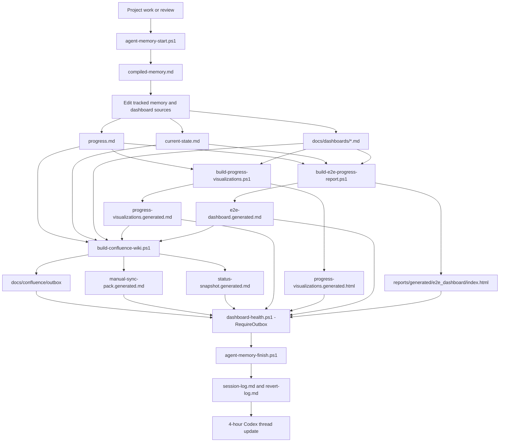
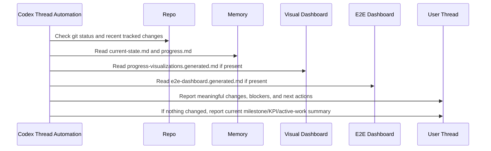

# VEGO-AI Research Operations

Generated from repository memory on 2026-09-06 16:19 +03:00.

## Roadmap

# Roadmap

## Milestones

| ID | Milestone | Status | Exit Criteria |
| --- | --- | --- | --- |
| M0 | Architecture baseline | Done | Folder structure, Git hygiene, memory, GitHub baseline, and docs are in place. |
| M1 | Human Review Queue | Done | Selective intervention creates signed review items with trigger reasons. |
| M2 | Human Feedback Manager | Done | Structured feedback validates, attaches to review items, and preserves status/signatures. |
| M3 | Human Judgment Memory | Done | Reusable resolved judgments are stored with provenance, explainable retrieval, and conflict detection; published as commit `5e109e5`. |
| M4A | Memory Advisory Layer | Done | Advisory report retrieves relevant memory for Agent 4 patterns with `ai_classification_changed=false`; PR #2 squash-merged as `ecd0972`. |
| M4B | Memory-informed parallel comparison experiment | Design contract approved | M4B-1 must write only a parallel `memory_informed_comparison.json`, preserve original Agent 4 output, label leakage, and land implementation through a reviewed branch/PR. |
| M5 | Human-approved guideline refinement | Planned | Guideline changes require explicit human approval and traceable provenance. |
| M6 | MSc thesis evidence and PhD continuation | Planned | Claim/evidence table, C0-C4 results, validity analysis, and continuation roadmap are coherent. |
| OPS-1 | Data and artifact audit | In progress | Data sensitivity, provenance, and publishability recorded without exposing controlled contents. |
| OPS-2 | Reproducibility baseline | In progress | Framework/evaluator commands rerun or validated; generated outputs are linked to experiment records. |
| OPS-3 | Confluence wiki sync | Blocked | Curated wiki pages generated after meaningful prompts; live Confluence updates wait for Atlassian Rovo cloud access. |

## Weekly Review

At least once per week:

- update `experiments/registry.md`,
- update active issues,
- review risks,
- archive or label outputs,
- refresh Confluence outbox or live wiki pages,
- summarize progress in agent memory.


## Risk Register

# Risk Register

| ID | Risk | Impact | Probability | Mitigation | Status |
| --- | --- | --- | --- | --- | --- |
| RISK-001 | No baseline Git commit yet. | Reverts are weaker. | High | Baseline GitHub history exists on `main`; keep committing safe changes and avoid force pushes. | Resolved |
| RISK-002 | Data sensitivity is not fully audited. | Accidental disclosure. | Medium | Complete data management and IRB checklist. | Open |
| RISK-003 | LLM outputs may drift over time. | Reproducibility risk. | High | Record model/API settings and preserve outputs used in claims. | Open |
| RISK-004 | Existing outputs may be mixed with future reruns. | Analysis confusion. | Medium | Use experiment IDs and output manifests. | Open |
| RISK-005 | Code changes may alter scientific behavior. | Invalid comparisons. | Medium | Add tests and require experiment notes for behavior changes. | Open |
| RISK-006 | Confluence can drift from repository memory. | External wiki becomes misleading. | Medium | Generate curated wiki pages after memory updates at the end of every meaningful prompt. | Open |
| RISK-007 | Confluence target IDs are not configured yet. | Live wiki sync is pending. | Medium | Use `docs/confluence/wiki-sync-config.local.json` when available; otherwise generate ignored outbox pages. | Open |
| RISK-008 | Research story becomes a coding extension rather than a thesis contribution. | Contribution appears weak. | Medium | Keep the main claim centered on reusable human judgment and design-science evaluation. | Open |
| RISK-009 | "Human in the loop" is too broad. | Construct validity suffers. | Medium | Define the human role as selective review, structured decision, reuse scope, and conflict adjudication. | Open |
| RISK-010 | Future AI reuse claims are not grounded in evidence. | Overclaiming. | Medium | Keep M3 inert, keep M4A advisory-only, and reserve behavior-improvement claims for the planned C4B experiment. | Open |
| RISK-011 | Evaluation set is too small for strong claims. | Weak conclusion validity. | Medium | Report limits, use staged C0-C4 comparisons, and expand cases before final claims. | Open |
| RISK-012 | Human judgments may conflict. | Memory may encode disagreement. | Medium | Use M3 conflict detection and require adjudication before treating conflicts as reusable guidance. | Open |
| RISK-013 | M4B reuses memory from the same pattern being evaluated. | M4B can look stronger than it generalizes. | Medium | Require `evaluation_leakage_status` on every comparison item and prefer leave-one-pattern-out, cross-setting, cross-domain, cross-diagram, or expert-only holdout evaluation. | Open |
| RISK-014 | M4B implementation lands directly on `main`. | AI decision-boundary changes bypass review. | Medium | Enforce branch `feature/memory-informed-comparison`, PR review, and Codex isolation for VEGO-AI milestone implementation files. | Open |
| RISK-015 | EXP-005 has no real expert labels yet. | Accuracy improvement and generalization cannot be evaluated. | High | Fill at least 20 generalization-safe EXP-005 labels, preferably all 24 current safe candidates and then 30-50 across audited runs. | Open |
| RISK-016 | Synthetic or same-pattern results are misreported as accuracy improvement. | Thesis claims become invalid. | Medium | State that EXP-004 is synthetic-only and same-pattern rows are mechanism validation only; require the EXP-005 gate status in all accuracy claims. | Open |
| RISK-017 | Manual CSV labeling workflow creates file locks or unsaved-label ambiguity. | EXP-005 evidence reruns can fail or use stale labels. | Medium | Stop automatic reopen loops; save and close Excel before downstream runs; validate supplied labels before running evidence scripts. | Open |
| RISK-018 | Single-reviewer labeling is treated as definitive. | Construct validity and reliability remain weak. | Medium | Add a second reviewer or supervisor adjudication for disputed rows before strong quantitative claims. | Open |


## Experiment Registry

# Experiment Registry

Latest accepted H-layer state: iteration 015, `HLAYER-UNIFIED-HARDENING-V1`, `NEUTRAL`, reliability-only unified-runtime parity and security hardening; normalized `f8de360cb3c7a6939d17bc76ae8f6493c81d8d7d1f34c598abb0bd970a6a4a11`. The replay evidence remains the iteration-014 suite `hlayer-20260720T173308Z-d79047f5e2`; the separate conformance run remains `HLAYER-CONFORMANCE-8c458da3755870930900`. Iteration 015 selects no routing, verification, correction, accuracy, or model default. Legacy runtime mode and GPT-4o remain the defaults.

| ID | Title | Status | RQ | Code/Config | Outputs | Notes |
| --- | --- | --- | --- | --- | --- | --- |
| EXP-000 | Existing packaged results audit | Planned | RQ1-RQ4 | `VEGO-AI/`, `experiments/EXP-000-existing-packaged-results-audit/` | Metadata registers; controlled outputs local/ignored | Map existing paper results to reproducible records without copying controlled artifacts into Git. |
| EXP-001 | M4B-1 memory-informed parallel comparison experiment | Initial mechanism/readiness run complete | RQ4 | `VEGO-AI/framework/human_judgment_memory.py`, `VEGO-AI/framework/memory_advisor.py`, `VEGO-AI/framework/memory_informed_classifier.py`, `scripts/build-exp001-evaluation.ps1`, `experiments/EXP-001-memory-assisted-agent4-controlled-experiment/` | Ignored `reports/generated/exp001/` tables and summary JSON; controlled source outputs local/ignored | Initial run: 27 comparisons, 3 same-pattern expert labels, 0 generalization-safe expert labels, 0 memory-informed classification changes, 2 human-review-after-memory flags. No accuracy-improvement claim allowed yet. |
| EXP-002 | Expert label expansion and holdout evaluation | Labeling package ready; expert labels pending | RQ4 | `scripts/build-exp002-labeling-package.ps1`, `experiments/EXP-002-expert-label-expansion-holdout-evaluation/` | Ignored `reports/generated/exp002/` expert-labeling sheet, recommended sampling list, and summary JSON | Prepares independent expert labels for generalization-safe M4B-1 evaluation. No M4B-2, Agent 4, LLM/API, or baseline-output changes. |
| EXP-003 | Accuracy improvement evaluation | Tooling added; labels pending | RQ4 | `[controlled analysis path omitted]evaluate_accuracy_improvement.py`, `scripts/build-exp003-error-analysis.ps1`, `experiments/EXP-003-accuracy-improvement-evaluation/` | Ignored `reports/generated/exp003/` full/blind labeling sheets, error analysis, accuracy summary, paired comparison, and figures | Evaluation-first path for accuracy improvement. Stops accuracy claims when there are fewer than 20 generalization-safe expert labels; no Agent 4, M4B-2, LLM/API, embedding, or baseline-output changes. |
| EXP-004 | Policy sensitivity simulation | Tooling added; synthetic-only initial run | RQ4 | `scripts/policy_sensitivity_simulation.py`, `scripts/build-policy-sensitivity-simulation.ps1`, `experiments/EXP-004-policy-sensitivity-simulation/` | Ignored `reports/generated/policy_sensitivity/` matrix, predictions, summary, and report | Tests candidate M4B-1.1-style policy variants under synthetic labels only. Not expert evidence; no Agent 4, M4B-2, LLM/API, embedding, eval_output, or baseline-output changes. |
| EXP-005 | Real-label accuracy evaluation and policy gate | Label-review package tooling added; real labels pending | RQ4 | `scripts/exp005_label_review.py`, `scripts/build-exp005-label-review.ps1`, `experiments/EXP-005-real-label-accuracy-gate/` | Ignored `reports/generated/exp005_label_review/` label-review package, adjudication sheet, validation summary, evidence verdict, reproducibility manifest, and real-label policy gate; ignored `artifacts/EXP005_LABEL_REVIEW_PACKAGE.md` | Prepares supervisor/expert labeling materials, validates filled labels, tracks reviewer/adjudication reliability, and blocks M4B-1.1/M4B-2 until at least 20 generalization-safe labels justify a deterministic policy change. |
| EXP-006 | H-Listen event replay | Iteration-014 reliability snapshot current; iteration-009 contract repair retained | RQ1/RQ2 (H-layer observability) | `scripts/exp006_event_replay.py`, `experiments/EXP-006-hlayer-event-replay/` | Ignored `reports/generated/exp006/` events + summary + manifest | 481 captured records plus 20 explicit gap records = 501 contract records. `11 queue items / 481 heterogeneous reconstructed lifecycle events` remains a count ratio only; no event-level visibility inference or linkage exists. Mechanism evidence only. |
| EXP-007 | S2 dosage-mode replay | Iteration-014 reliability snapshot current; M-03 unrecorded | RQ2 (dosage calibration) | `scripts/exp007_dosage_replay.py`, `experiments/EXP-007-dosage-mode-replay/` | Ignored `reports/generated/exp007/` summary + manifest | `threshold_sev2`: event load 0.799, transaction load 0.796, weighted coverage 0.981, high-severity coverage 1.0. Aggregate coverage >=0.8 at load <=0.5 remains unmet. Pareto evidence only; no default. |
| EXP-008 | Early-trigger mining | Iteration-014 reliability snapshot current; M-03 unrecorded | RQ2 (early triggers) | `scripts/exp008_trigger_mining.py`, `experiments/EXP-008-early-trigger-mining/` | Ignored `reports/generated/exp008/` detail + summary + manifest | Uniform K30 capture 0.75; K35 capture 0.85. Report the cap/capture trade-off only; no uniform or adaptive cap is approved. |
| EXP-009 | H-Verify seeded-conflict dry run | Provisional synthetic prototype run complete; protocol unapproved | RQ3/RQ4 (anti-sycophancy design) | `scripts/exp009_seeded_conflict.py` | Ignored `reports/generated/exp009/` | Assumption-driven `SYNTHETIC_NOT_HUMAN` rule test, isolated from real stores. It does not validate behavior on real expert mistakes; M-04 remains unrecorded. |
| EXP-010 | Convergence-bound sweep | Provisional synthetic prototype run complete; protocol unapproved | RQ4 (convergence policy) | `scripts/exp010_convergence_sweep.py` | Ignored `reports/generated/exp010/` | Assumption-driven synthetic rule sweep. Resolution and escalation are separate outcomes; the run cannot approve a two-round bound. |
| EXP-011 | Version 0 vs Version 1 comparison | PARKED (evaluation track) | RQ4 (accuracy - blocked) | Parked per `docs/architecture/evaluation-diagram.md` | - | Iris's V0/V1 + usability design; requires >=20 generalization-safe real labels via EXP-005 and supervisor go-ahead. |
| EXP-012 | Validated EXP-005 baseline interface (M-D) | Interface repaired and cross-check passed; zero-label gate not computable | RQ4 (measurement infrastructure) | `scripts/exp012_accuracy_baseline.py`, `experiments/EXP-012-accuracy-baseline-scaffold/` | Ignored `reports/generated/exp012/` | Reads the validated EXP-005 full export + validation summary, requires explicit safe/leakage/provenance fields, and matches the canonical EXP-003 evaluator at N=0. Generalization-safe M-D remains `NOT YET COMPUTABLE`; historical same-pattern pilot is excluded. |
| EXP-013 | Event-contract fidelity | Offline fixture run complete; validator passed | H-layer contract conformance | `scripts/exp013_event_contract_fidelity.py`, `experiments/EXP-013-event-contract-fidelity/` | Ignored `reports/generated/exp013/` | Five fixture records schema-valid; captured/reconstructed lineage complete; E3/E9 gaps explicit; E15 parked. Fixture mechanism evidence only; no live-hook authorization. |
| EXP-014 | Replay determinism | Offline fixture run complete; validator passed | H-layer replay reliability | `scripts/exp014_replay_determinism.py`, `experiments/EXP-014-replay-determinism/` | Ignored `reports/generated/exp014/` | Three normalized fixture replays produced identical hashes and no duplicate review-item IDs. |
| EXP-015 | Workload, bundling, and fairness | Offline fixture run complete; validator passed | H-layer workload design | `scripts/exp015_workload_bundling_fairness.py`, `experiments/EXP-015-workload-bundling-fairness/` | Ignored `reports/generated/exp015/` | Fixed-denominator fixture comparison only; high-severity preservation, collision checks, aging, and deferred recovery reported. No approved cap or workload forecast. |
| EXP-016 | Role-based action authorization (not claim-specific authority - see ISS-045) and timeout safety | Offline synthetic fixture run complete; validator passed | H-layer safety | `scripts/exp016_authority_timeout_safety.py`, `experiments/EXP-016-authority-timeout-safety/` | Ignored `reports/generated/exp016/` | `SYNTHETIC_NOT_HUMAN` cases preserved baseline hashes, parked timeout/denial paths, and produced zero trusted-memory writes/correction applications. No implementation authority. "Authority" here means role-based action authorization (not claim-specific authority - see ISS-045). |
| EXP-017 | Verification provenance | Offline synthetic fixture run complete; validator passed | H-Verify provenance | `scripts/exp017_verification_provenance.py`, `experiments/EXP-017-verification-provenance/` | Ignored `reports/generated/exp017/` | Deterministic-first four-family fixture trace passed; semantic checks absent; missing/conflicting cases require adjudication. M-04 remains unrecorded. |
| EXP-018 | Correction-proposal dry run | Offline synthetic fixture run complete; validator passed | S6 proposal safety | `scripts/exp018_correction_proposal_dry_run.py`, `experiments/EXP-018-correction-proposal-dry-run/` | Ignored `reports/generated/exp018/` | Reproducible diff over a disposable copy with target hash/rollback; `applied=false`; repository fixture unchanged. No correction authorization. |
| EXP-019 | Reviewer calibration without evaluation leakage | Evaluation-ready; human reviewers pending | E-RQ1 / label reliability | `experiments/EXP-019-reviewer-calibration/`, `docs/research/thesis-evidence/REVIEWER_CALIBRATION_PROTOCOL.md` | Future human calibration records; never copied into evaluation metrics | Uses the three excluded same-pattern rows to clarify the protocol. It supplies no performance or generalization evidence. |
| EXP-020 | Independent expert labeling of 24 safe candidates | Pending expert input | E-RQ1 / H1-H3 evidence gate | `experiments/EXP-020-independent-expert-labeling/`, `schemas/gold-label-record-v2.schema.json` | Future immutable reviewer returns, kappa report, adjudication records, and frozen gold-label manifest | Two blind reviewers plus adjudication. At 1-19 safe labels reporting is pilot-only; at 20-24 it is a small-sample MSc quantitative evaluation. |
| EXP-021 | Development-only baseline error characterization | Blocked on EXP-020 | E-RQ1 / H1 | `experiments/EXP-021-development-baseline-error-analysis/` | Future 16-row development confusion matrix, taxonomy, and error heatmap | The eight-row holdout remains sealed. No policy is selected in this experiment. |
| EXP-022 | Routing and retrieval validity audit | Blocked on EXP-021 | E-RQ2 / H1-H2 | `experiments/EXP-022-routing-retrieval-validity/` | Future routing/retrieval audit with explicit denominators and leakage classes | Tests targeting and relevance only; it cannot independently prove accuracy improvement or reduced effort. |
| EXP-023 | Deterministic policy development | Proposal — not approved | E-RQ3 / H3 | `experiments/EXP-023-deterministic-policy-development/`, `schemas/policy-candidate-record-v1.schema.json` | Future frozen `PolicyCandidateRecord-v1` | Entry requires at least three correctable development errors across at least two settings plus explicit supervisor approval. Output remains parallel and non-destructive. |
| EXP-024 | One-time sealed eight-row holdout pilot | Blocked on approved EXP-023 policy | E-RQ3 / H3 | `experiments/EXP-024-sealed-holdout-pilot/`, `schemas/evaluation-run-manifest-v2.schema.json` | Future paired pilot report and run manifest | N=8 is pilot-only. Policy cannot change after holdout inspection. |
| EXP-025 | External education-domain replication | Proposal — not approved | E-RQ3 / H3 | `experiments/EXP-025-external-education-replication/` | Future external paired report, exact McNemar result, confidence intervals, and subgroup checks | Minimum N=30, target N=48. This is the only planned formal-improvement gate; every preregistered criterion must pass. |
| EXP-026 | Human-effort study | Proposal — not approved | H4 | `experiments/EXP-026-human-effort-study/` | Future consented review-time and escalation-quality study | Queue counts are not effort evidence. No reduced-effort claim is allowed before this controlled study. |
| EXP-027 | Ablation and robustness | Proposal — not approved | E-RQ2/E-RQ3 | `experiments/EXP-027-ablation-robustness/` | Future ablation, sensitivity, and failure-mode appendix | Runs only after the primary external analysis and cannot tune or rescue it. |
| EXP-028 | Model execution reproducibility and drift | Proposed protocol only | Model provenance / reliability | `experiments/EXP-028-model-execution-reproducibility/`, `schemas/model-execution-manifest-v1.schema.json` | Future frozen-snapshot execution manifests and drift report | Descriptive protocol only. It does not select a model or establish accuracy. Historical GPT-4o alias snapshot remains unknown. |
| EXP-029 | Frozen candidate-model comparison | Blocked | Model comparison / E-RQ3 | `experiments/EXP-029-frozen-candidate-model-comparison/`, `docs/research/hardening/MODEL_EVALUATION_PROTOCOLS.md` | Future paired sealed-holdout comparison | Requires >=20 safe labels, reviewer agreement/adjudication, frozen prompt/policy/partition, supervisor approval, and a cost ceiling. GPT-4o remains default. |
| EXP-030 | BigUI source fidelity and provenance | Evaluation-ready | Observatory integrity | `experiments/EXP-030-bigui-source-fidelity/`, `scripts/build_bigui_catalog.py` | Tracked sanitized catalog, artifact snapshot, and deterministic BigUI | Infrastructure-only fidelity gate. It rejects stale, duplicate, dangling, private, and unhashable records; it provides no accuracy evidence. |
| EXP-031 | BigUI formative usability | Proposal — not approved | BigUI usability | `experiments/EXP-031-bigui-formative-usability/`, `schemas/bigui-study-record-v1.schema.json` | Future consented local task records and publishable aggregates | Five to eight participants for descriptive formative refinement only. No participant data is invented or tracked. |
| EXP-032 | BigUI decision-support comparison | Blocked | BigUI decision value | `experiments/EXP-032-bigui-decision-support/`, `schemas/bigui-study-record-v1.schema.json` | Future counterbalanced interface comparison | Requires a frozen interface/protocol and at least 20 consented participants. Value claims are limited to measured tasks and preregistered outcomes. |
| EXP-033 | Full-corpus runtime parity | Offline evidence | Architecture equivalence | `experiments/EXP-033-full-corpus-runtime-parity/`, `scripts/run_bigui_architecture_experiments.py` | Accepted parity manifests and sanitized aggregates | Three deterministic repetitions over equivalent immutable inputs passed semantic parity with zero baseline changes. Mechanism evidence only. |
| EXP-034 | H-layer topology trade-off | Offline evidence | Architecture topology | `experiments/EXP-034-hlayer-topology-tradeoff/`, `scripts/run_bigui_architecture_experiments.py` | Accepted offline topology Pareto results | A/B/C produced contract-equivalent outputs. M-02 remains deferred, so the experiment does not select a production topology. |
| EXP-035 | Fault injection and role-based action authorization safety (not claim-specific authority - see ISS-045) | Offline evidence | Architecture safety | `experiments/EXP-035-fault-injection-authority-safety/`, `scripts/run_bigui_architecture_experiments.py` | Accepted deterministic negative-fixture manifests and safety matrix | The finite fault catalog passed baseline preservation, zero unsafe memory writes, zero correction applications, and correct park/escalate behavior. "Authority" here means role-based action authorization (not claim-specific authority - see ISS-045). |
| EXP-036 | Scale, latency, and reproducibility | Offline evidence | Architecture operations | `experiments/EXP-036-scale-latency-reproducibility/`, `scripts/run_bigui_architecture_experiments.py` | Accepted current and synthetic 5×/10× operational measurements | The latest accepted run meets the declared unified and parity p95 ratio limits; accepted history retains an older unified p95 miss. Operational evidence only; no accuracy, effort, or generalization conclusion. |
| EXP-037 | Paper baseline reconciliation | Offline evidence | Paper and thesis baseline alignment | `experiments/EXP-037-paper-baseline-reconciliation/`, `scripts/run_bigui_comparison_experiments.py` | Tracked reviewed paper snapshot and version-reconciliation metrics | The paper draft reports 178 models and 26 patterns; the current frozen repository reports 179 and 27. The difference is contextual and never called an accuracy improvement. |
| EXP-038 | Architecture improvement scorecard | Offline evidence | Architecture capability and reliability evidence | `experiments/EXP-038-architecture-improvement-scorecard/`, `scripts/run_bigui_comparison_experiments.py` | Multidimensional capability, parity, safety, and empirical-gap scorecard | Demonstrates new H-layer capabilities and accepted mechanism reliability while leaving classification and effort cells null. |
| EXP-039 | Cross-experiment comparability and deltas | Offline evidence | Metric comparison integrity | `experiments/EXP-039-cross-experiment-comparability/`, `scripts/run_bigui_comparison_experiments.py` | Routing, topology, runtime trade-offs and refused-comparison register | Produces deltas only where cohort, metric, grain, evidence, and declared treatment permit direct comparison. |
| EXP-040 | Thesis claim-readiness audit | Offline evidence | Thesis evidence alignment | `experiments/EXP-040-thesis-claim-readiness/`, `scripts/run_bigui_comparison_experiments.py` | RQ, hypothesis, claim, experiment, and gate readiness matrix | Mechanism claims are traceable now; empirical improvement hypotheses remain unconfirmed at 0/24 safe labels. |
| EXP-041 | Governed-judgment conformance (Study 2 Phase A instrument) | Tooling added; offline mechanism run pending | C2 / SQ2 contract conformance | `scripts/run_governed_contract_conformance.py`, `src/vego_governed/`, `schemas/governed-judgment-record-v1.schema.json`, `experiments/EXP-041-governed-judgment-conformance/` | Ignored `reports/generated/exp041/` once a first offline run is accepted | Executable reconstructability, discrimination, and completeness-review suite over the reference `GovernedJudgmentRecord-v1` example; planted non-conforming variants must fail for their named reasons. Mechanism evidence only; conformance is never evidence of improved judgment outcomes (EXP-005 0/24). |
| EXP-042 | Six-arm policy replay determinism at a fixed budget (Study 1 Phase A mechanism) | Tooling added; offline mechanism run pending | C1 / SQ1 policy mechanism | `src/vego_governed/policy.py`, `schemas/review-policy-signal-contract-v1.schema.json`, `experiments/EXP-042-policy-arm-replay-determinism/` | Ignored `reports/generated/exp042/` once a first offline run is accepted | Six section-3.3 comparator arms as configurations of one engine replayed over frozen synthetic fixtures at one fixed matched budget; determinism and ledger integrity only. No important-case labels exist (EXP-005 0/24), so no capture or effectiveness measure is computed and no arm is selected. |
| EXP-043 | Reuse-gate order and outcome fidelity (Study 3 mechanism precursor) | Tooling added; offline mechanism run pending | C3 / SQ3 reuse procedure mechanism | `src/vego_governed/reuse.py`, `schemas/reuse-decision-record-v1.schema.json`, `experiments/EXP-043-reuse-gate-fidelity/` | Ignored `reports/generated/exp043/` once a first offline run is accepted | Frozen gate order g1-g5 with short-circuit non-exposure of restricted evidence, all four outcomes reachable, `reuse_undetermined` routed to independent review, and an outcome receipt per evaluation. Mechanism evidence only; no reuse-benefit or capability-gap claim (EXP-005 0/24). |
| EXP-044 | Field-removal ablation harness readiness (Study 2 Phase B instrument validation) | Tooling added; offline mechanism run pending | C2 / Study 2 Phase B instrument | `schemas/governed-judgment-record-v1.schema.json`, `src/vego_governed/records.py`, `experiments/EXP-044-field-removal-ablation-harness/` | Ignored `reports/generated/exp044/` once a first offline run is accepted | Per-component strike profiles GJR-ABL-01..06 (`field_removal`, `delete_top_level_property`) exercised against the reference example for per-component identifiability. Explicitly instrument readiness, not the ablation study; no effect on human judgment is measured (EXP-005 0/24). |
| EXP-045 | Escalation-point demonstration on the frozen course run (preliminary study for the proposal) | Descriptive inventory run locally 2026-09-02; blind human marks pending (2026-09-06) | SQ1 (when to escalate) - descriptive | `scripts/exp045_escalation_points.py`, `scripts/tests/test_exp045_escalation_points.py`, `experiments/EXP-045-escalation-point-demonstration/` | Ignored `reports/generated/exp045/` per-setting escalation-point JSON and summary table | Reads only the frozen run over Cheers/ParkWise (179 models, 27 patterns, 4 settings) and lays out, per stage, where existing signals would have suggested asking a human and where the reference bases disagree (Stage 2: 59 of 80 reference domain guidelines missed; Stage 3: 491 alternative-reading fragments over 165 case files; Stage 4: 11 of 27 patterns queued). Demonstrates WHEN-to-escalate points only; no improvement, accuracy, effort, or generalization claim (EXP-005 0/24); no users; no synthetic data; no Agent 4 or baseline change. |
| EXP-046 | Recorded human review of the frozen run (empirical baseline for the preliminary study) | Analysis run 2026-09-02 over the delivered dataset | SQ1 (when to escalate) - descriptive | `scripts/exp046_recorded_review.py`, `scripts/exp046_synthetic_rehearsal.py`, `scripts/tests/test_exp046_recorded_review.py`, `scripts/tests/test_exp046_synthetic_rehearsal.py`, `experiments/EXP-046-recorded-review-analysis/` | JSON summary written where `--json` points; the source workbooks stay outside the repository (student submission ids) | Reads the published MODELS 2026 expert assessment (co-authors acting as domain experts across all phases; verified to reproduce the paper's own Table 3): Stage 2, 68 of 169 agent-written guidelines not fully aligned plus 17 required guidelines the agent never wrote, and 59 course requirements unmatched; Stage 3, 120 of 915 compliance judgments and 27 of 104 alternative-or-mistake judgments overturned (147 of 1,019 pooled). The agent's own verdict separates them: `Satisfied` 1.8% overturned against `Partially-Satisfied` 46.3%, so escalating everything not called `Satisfied` flags 28% of items and covers 90% of the overturns. Agent score against course grade r = 0.25 over 164 rows. Descriptive only: `overturned` is a reviewer disagreement, not a demonstrated error; the review is the project's own and its items were reviewer-chosen, not random; no accuracy, improvement, effort or generalization claim; EXP-005 remains 0/24. |


## Artifact Audit

# Artifact Audit

Metadata-only audit for artifacts that are ignored, deferred, generated, or potentially sensitive. Do not paste controlled artifact contents here.

## Default Rule

Unless an artifact has an explicit publish decision, treat it as `Controlled / do not publish`.

## Deferred Artifact Register

| Artifact | Type | Current Location | Git Status | Sensitivity Default | Publishability | Next Action |
| --- | --- | --- | --- | --- | --- | --- |
| IRB / paper PDF | Research document | Repository root, `*[PDF omitted]` | Ignored | Controlled | Do not publish | Review protocol, consent, anonymization, and sharing terms. |
| Source delivery archive | Archive | Repository root, `*[archive omitted]` | Ignored | Controlled | Do not publish | Keep local backup; publish only if audited and needed. |
| Nested UI archive | Archive | `VEGO-AI/VEGO-AI-UI[archive omitted]` | Ignored | Controlled | Do not publish | Audit contents before any release decision. |
| Case models | Research data | `[controlled case-model path omitted]` | Ignored | Controlled | Do not publish | Audit provenance, anonymization, and permission. |
| Expert analysis | Research analysis | `[controlled analysis path omitted]` | Ignored | Controlled | Do not publish | Map to `EXP-000` with metadata only. |
| Evaluation outputs | Generated results | `[controlled eval-output path omitted]` | Ignored | Controlled | Do not publish | Record provenance and selected evidence after audit. |
| Human review outputs | Generated review queue | `[controlled human-review-output path omitted]` | Ignored | Controlled | Do not publish | Regenerate through documented commands when needed. |
| Visualizer bundled models | Research data | `[controlled visualizer-model path omitted]` | Ignored | Controlled | Do not publish | Audit with case models. |
| Visualizer compliance vectors | Generated outputs | `[controlled compliance-vector path omitted]` | Ignored | Controlled | Do not publish | Link only summarized results after audit. |
| Visualizer bundled guidelines | Generated/reference outputs | `[controlled visualizer-guideline path omitted]` | Ignored | Controlled | Do not publish | Audit provenance before publishing. |
| Bundled executable | Binary package | `VEGO-AI/vego_visualizer_delivery/VEGO-AI[binary omitted]` | Ignored | Controlled | Do not publish | Rebuild from source if a release is needed. |
| Local milestone change archive | Archive | `artifacts/vego-ai-M1-M2-changes[archive omitted]` | Ignored | Controlled | Do not publish | Keep local only unless explicitly audited and needed. |
| Local Claude settings | Local tool state | `.claude/*.local.json` | Ignored | Local-only | Do not publish | Keep machine-specific permissions out of Git. |
| Compiled memory | Generated context | `docs/agent-memory/compiled-memory.md` | Ignored | Internal | Do not publish | Regenerate per prompt. |
| Confluence outbox | Generated wiki draft | `docs/confluence/outbox/` | Ignored | Internal | Do not publish | Regenerate after memory updates. |

## Audit Status

- Current status: Metadata audit complete.
- Last metadata pass: 2026-07-11.
- Content audit status: Checked all tracked files; no sensitive personal identifiers found in Git. Raw student models and expert worksheets are git-ignored by default.
- IRB review status: IRB protocol `IRB2-Iris` identified; student data is fully anonymized and restricted to local research use only.


## Provenance Register

# Provenance Register

Record where datasets, outputs, and evidence artifacts came from. Keep this register metadata-only until the data/IRB audit is complete.

| ID | Artifact Group | Source | Date Received/Created | Owner/Permission | Storage Location | Transformations | Linked Experiment | Status |
| --- | --- | --- | --- | --- | --- | --- | --- | --- |
| PROV-001 | Original source package | Delivered archive `VEGO-AI-20260611T112722Z-3-001[archive omitted]` | 2026-06-11 | Unknown | Repository root, ignored | Extracted to `VEGO-AI/` | `EXP-000` | Metadata recorded; content audit pending. |
| PROV-002 | Preserved runnable code | Extracted from delivered archive | 2026-06-11 | Unknown | `VEGO-AI/framework/`, `VEGO-AI/eval/` | Safe source subset committed to GitHub | `EXP-000` | Tracked safe code baseline exists. |
| PROV-003 | Lightweight input texts | Extracted from delivered archive | 2026-06-11 | Unknown | `VEGO-AI/inputs/` | Committed lightweight text inputs | `EXP-000` | Tracked; publishability still pending review. |
| PROV-004 | Case models | Extracted from delivered archive | 2026-06-11 | Unknown | `[controlled case-model path omitted]` | None recorded | `EXP-000` | Ignored; audit pending. |
| PROV-005 | Expert analysis and eval outputs | Extracted from delivered archive | 2026-06-11 | Unknown | `[controlled analysis path omitted]`, `[controlled eval-output path omitted]` | None recorded | `EXP-000` | Ignored; audit pending. |
| PROV-006 | Human feedback workflow examples | Created during Milestone 2 work | 2026-06-11 | Project generated | `VEGO-AI/inputs/human_feedback.example.jsonl` | Manual examples for schema/test coverage | Human-AI co-reasoning docs | Tracked safe example; continue checking for real expert data. |

## Required Fields For Future Entries

- Source and owner.
- Date received or created.
- Permission and sharing constraints.
- Storage location.
- Transformation history.
- Linked experiment or paper claim.
- Sensitivity and publishability status.


## Publishability Register

# Publishability Register

Track whether a project artifact can be shared in GitHub, Confluence, papers, thesis appendices, or external supplements.

## Status Values

- `Allowed`: safe to publish in the named venue.
- `Controlled`: do not publish until reviewed.
- `Metadata only`: record path/category/status, not contents.
- `Generated internal`: regenerate locally; do not publish by default.
- `Unknown`: missing provenance or permission.

## Register

| Artifact Group | GitHub | Confluence | Paper/Thesis | External Supplement | Reason | Required Approval |
| --- | --- | --- | --- | --- | --- | --- |
| Source code in `VEGO-AI/framework/` and `VEGO-AI/eval/` | Allowed | Summary only | Describe methods | Maybe | Already safely published to private GitHub. | Owner review before public release. |
| Project docs and architecture | Allowed | Allowed | Reuse/adapt | Maybe | Contains project process, not controlled data. | Normal review. |
| Agent memory logs | Allowed in private repo | Summary only | No | No | Useful operational history, but noisy and may include process details. | Review before external sharing. |
| Root PDF / IRB-related material | Controlled | Metadata only | Controlled | No | May contain protocol, review, or unpublished paper content. | IRB/protocol and author approval. |
| Source archives and executables | Controlled | Metadata only | No | No | Large/binary and unaudited. | Owner and data audit approval. |
| Case models and visualizer bundled models | Controlled | Metadata only | Controlled examples only | Controlled | May include student/participant/institutional data. | IRB/provenance approval. |
| Analysis and eval outputs | Controlled | Metadata only | Controlled summaries | Controlled | May encode model or expert-label content. | IRB/provenance approval. |
| Generated Confluence outbox | Generated internal | Not tracked | No | No | Draft mirror generated from safe docs. | Configure live target before use. |
| EXP-005 blind/adjudication label sheets | Generated internal | Metadata only | Controlled summaries | Controlled | May contain expert labels, rationales, reviewer IDs, and adjudication notes. | Supervisor/reviewer consent plus IRB/provenance approval. |
| EXP-005 evidence verdict and reproducibility manifest | Generated internal | Summary only | Controlled summaries | Maybe | Summarizes label counts and evidence status; can be shared after checking it contains no sensitive rationales. | Owner review and data/IRB audit. |
| Thesis-ready summary tables | Allowed after review | Allowed after review | Reuse/adapt | Maybe | Derived aggregate counts are safer than raw labels but still need claim and data review. | Supervisor review and publishability check. |

## Current Decision

No deferred artifacts move from `Controlled` to `Allowed` until `docs/research/ethics-irb.md` and this register are explicitly updated.


## Progress Update Architecture

# Progress Update Architecture

This document defines how VEGO-AI progress updates are produced, visualized, checked, and reported back to the user.

The goal is simple: one update path should connect project memory, tracked progress, generated visual dashboards, Confluence outbox pages, and the 4-hour Codex thread check-in.

## Scope

This architecture covers:

- local progress tracking in `docs/agent-memory/progress.md`;
- current project orientation in `docs/agent-memory/current-state.md`;
- dashboard source pages in `docs/dashboards/`;
- generated visual summaries from `scripts/build-progress-visualizations.ps1`;
- the generated full E2E report and local web page from `scripts/build-e2e-progress-report.ps1`;
- generated wiki/outbox refresh from `scripts/build-confluence-wiki.ps1`;
- health verification from `scripts/dashboard-health.ps1`, `scripts/research-health.ps1`, and `scripts/project-health.ps1`;
- 4-hour Codex thread updates from the `vego-ai-4-hour-progress-updates` automation.

It does not replace the research gates. It must not auto-fill expert labels, change Agent 4 behavior, run M4B-2, or claim accuracy improvement without real EXP-005 evidence.

## Update Layers

| Layer | Source | Update Method | Output |
| --- | --- | --- | --- |
| Project memory | `docs/agent-memory/current-state.md`, `docs/agent-memory/progress.md`, session/revert logs | `scripts/agent-memory-start.ps1` and `scripts/agent-memory-finish.ps1` | Shared Codex/Claude state and compiled memory |
| Curated dashboards | `docs/dashboards/progress-dashboard.md`, `kpi-register.md`, `results-dashboard.md` | Manual evidence-backed edits | Stable tracked dashboard sources |
| Generated visuals | Progress, KPI, and dashboard Markdown | `scripts/build-progress-visualizations.ps1` | Ignored Mermaid Markdown and local HTML dashboard |
| E2E report | Memory, dashboard, experiment summary, review state, and Git status sources | `scripts/build-e2e-progress-report.ps1` | Ignored full report plus `reports/generated/e2e_dashboard/index.html` |
| Wiki package | Memory files and dashboard sources | `scripts/build-confluence-wiki.ps1` | Ignored Confluence outbox and manual sync pack |
| Verification | Tracked docs/scripts and generated safe outputs | `scripts/dashboard-health.ps1 -RequireOutbox`, `scripts/research-health.ps1`, `scripts/project-health.ps1` | Pass/fail health verdict |
| Scheduled update | Current thread automation | Codex heartbeat every 4 hours | Short thread update with changes, blockers, and next actions |

## Data Flow



## 4-Hour Update Loop



## Standard Refresh Commands

Run these from the repository root.

Refresh the visual progress dashboard:

```powershell
.\scripts\build-progress-visualizations.ps1
```

Refresh the full E2E progress report and local web page:

```powershell
.\scripts\build-e2e-progress-report.ps1
```

Refresh the wiki outbox, dashboard snapshot, visualizations, and manual sync pack:

```powershell
.\scripts\build-confluence-wiki.ps1
```

Verify the dashboard/wiki package:

```powershell
.\scripts\dashboard-health.ps1 -RequireOutbox
```

Run the broader health checks:

```powershell
.\scripts\research-health.ps1
.\scripts\project-health.ps1
```

## Update Contract

When progress changes:

1. Update `docs/agent-memory/progress.md`.
2. Update `docs/agent-memory/current-state.md` when the latest known state changes.
3. Update `docs/dashboards/` when KPI, result, or dashboard-facing status changes.
4. Run `.\scripts\build-progress-visualizations.ps1`.
5. Run `.\scripts\build-e2e-progress-report.ps1`.
6. Run `.\scripts\build-confluence-wiki.ps1`.
7. Run `.\scripts\dashboard-health.ps1 -RequireOutbox`.
8. Run `.\scripts\agent-memory-finish.ps1` with the summary, changed files, commands, status, next steps, and rollback note.

## 4-Hour Update Content

Each scheduled update should include:

- whether anything material changed;
- current milestone completion, KPI green rate, and active-work closure from `progress-visualizations.generated.md`;
- current review verdict, EXP-005 label gate, and next action from `e2e-dashboard.generated.md`;
- blockers that need the user, especially EXP-005 labels, Confluence access, or data/IRB decisions;
- the next concrete action;
- whether the repo has pending local changes.

It should not repeat long dashboard tables unless the user asks for detail.

## Guardrails

- Generated files under `docs/dashboards/*.generated.*`, `reports/generated/e2e_dashboard/**`, `docs/confluence/outbox/**`, and `docs/confluence/*.generated.md` stay ignored.
- Do not edit generated files directly; update tracked source docs and regenerate.
- Do not run dashboard health in parallel with `build-confluence-wiki.ps1`; the outbox is rewritten during the build.
- Do not publish controlled artifacts, PDFs, model files, generated report contents, or label sheets without approval.
- Do not claim accuracy improvement while EXP-005 has zero valid generalization-safe expert labels.
- If live Confluence access is unavailable, treat the outbox/manual sync pack as the pending wiki update.

