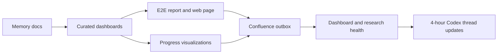

# VEGO-AI E2E Progress Report

Generated: 2026-08-20 01:58 +03:00.

This generated report connects repo memory, curated dashboards, generated experiment summaries, Confluence outbox status, and the 4-hour update loop. Regenerate it with `.\scripts\build-e2e-progress-report.ps1`.

## Executive Status

| Signal | Value | Visual |
| --- | --- | --- |
| Milestones done/green | 74 of 84 | [##################--] 88% |
| KPIs green | 11 of 30 | [#######-------------] 37% |
| Active work done | 21 of 50 | [########------------] 42% |
| Executive dashboard green | 6 of 22 | [#####---------------] 27% |
| Review verdict | unsafe | Next action: Stop and resolve protected-path or forbidden-artifact issues before continuing. |
| Git workspace | main @ 828b8bf | 8 pending status rows |

## E2E Evidence Snapshot

| Area | Current Value | Gate |
| --- | --- | --- |
| VEGO runtime snapshot | 4 settings, 179 cases, 27 variability patterns | Baseline AI classification changes: 0 |
| Human judgment chain | 11 review queue items, 3 reusable memory entries, 8 advice items | M4A/M4B-1 remain non-destructive |
| EXP-001 | 27 comparisons, 0 memory-informed classification changes, 0 safe expert labels | Mechanism/readiness only |
| EXP-002 | 27 labeling rows, 24 safe candidates | Human/supervisor labels pending |
| EXP-003 | 27 rows, 0 safe labeled rows | Accuracy improvement cannot be evaluated yet. |
| EXP-005 | 27 rows, 24 safe candidates, 0 supplied labels, 0 safe valid labels | Accuracy improvement cannot be evaluated yet. |

## Update Architecture



## Current Blockers

- EXP-005 has 0 supplied real labels.

## Open Active Work

| ID | Status | Summary | Next Step |
| --- | --- | --- | --- |
| TASK-003 | Open | Audit data sensitivity and provenance. | Review `VEGO-AI/inputs/`, `VEGO-AI/models/`, `VEGO-AI/analysis/`, and the IRB-related PDF. |
| TASK-004 | In progress | Map existing paper/package results to experiments. | Continue `EXP-000-existing-packaged-results-audit` without copying controlled artifacts into Git. |
| TASK-005 | Blocked | Keep curated Confluence wiki current. | Grant Atlassian Rovo access to cloud `724252a1-a5b7-45a5-b6ec-27a8292197ec`, then create/update child pages and store page IDs in local config. |
| TASK-008 | Open | Keep progress, KPI, and results dashboards current. | Update `docs/dashboards/` whenever progress, KPI values, validated results, or Confluence tracking status changes. |
| TASK-009 | Open | Keep dashboard/wiki tracking health verified. | Run `.\scripts\dashboard-health.ps1 -RequireOutbox` after every Confluence outbox build. |
| TASK-010 | Open | Keep runtime dashboard snapshot fresh. | Run `.\scripts\build-confluence-wiki.ps1` after memory/dashboard updates; it regenerates `docs/dashboards/status-snapshot.generated.md`. |
| TASK-011 | Open | Keep manual Confluence sync pack fresh while live access is blocked. | Run `.\scripts\build-confluence-wiki.ps1`; it regenerates `docs/confluence/manual-sync-pack.generated.md`. |
| TASK-013 | In review | Harden M4B nested schema requirements. | Review and merge PR #6. |
| TASK-016 | Open | Complete EXP-001 expert-label evaluation. | Add held-out/cross-setting expert labels, rerun `.\scripts\build-exp001-evaluation.ps1`, and update the evaluation report with generalization-safe metrics. |
| TASK-017 | Open | Fill EXP-002 expert labeling package. | Human/supervisor should label at least 20 rows, preferably all 27 current rows, then rerun evaluation with leakage-aware partitions. |
| TASK-019 | Open | Collect EXP-003 independent expert labels. | Fill the blind/full EXP-003 sheets with at least 20 generalization-safe labels before any accuracy-improvement claim or M4B-1 policy refinement. |
| TASK-020 | Open | Use EXP-004 to screen policy candidates after real labels exist. | Rerun `.\scripts\build-policy-sensitivity-simulation.ps1` after EXP-003 has real labels; treat current synthetic results as pipeline/risk screening only. |

## Open Issues

| ID | Severity | Status | Summary | Next Step |
| --- | --- | --- | --- | --- |
| ISS-034 | High | Open | This week's actual assignment from Iris (classify the ACL-2026 GitHub taxonomy corpus as relevant/less relevant/not relevant/missing, produce one slide) is not done in literature-review-v13. v13 instead ran nine broader search families across ACL/ACM/AAAI/PMLR/PubMed/ScienceDirect/web -- the broader search Iris explicitly deferred to after the proposal stage. | Do the narrow taxonomy classification exercise and the one slide before broadening the search further; see `docs/research/phd-proposal/literature-review-v13-workbook-verification-report.md` section D. |
| ISS-033 | High | Open | Literature-review-v13.docx states "Current readiness score: 84/100"; the companion evidence workbook's own `Dashboard.csv` independently computes `Overall literature readiness: 36`, `Release Decision: NOT DOCTORAL-READY`, for the same evidence state. Root cause: the workbook's `Provenance.csv` still names v10, not v13, as the current authoritative review -- the two artifacts are unreconciled. | Rebuild/rebase the workbook against v13 before either artifact is shown to Iris/Arnon; reconcile or drop the 84/100 figure. See `docs/research/phd-proposal/literature-review-v13-workbook-verification-report.md` sections A and C. |
| ISS-031 | Low | Open | This machine has two separate checkouts: the git worktree this session's shell defaults into (`.claude\worktrees\trusting-kilby-79f5d4`, an old branch missing `docs/research/phd-proposal/`, `thesis/chapters/`, and most current `issues.md`/`decisions.md` history) and the real working checkout at `C:\Users\ahamed\vego-ai` on `main`, which is where all real work happens. Two of eight parallel sub-agents in a gaps-sweep read the stale worktree and falsely concluded real files/tables "don't exist." | Always explicitly `cd` to `C:\Users\ahamed\vego-ai` before any git/file operation (this session already does); consider deleting or fast-forwarding the stale worktree; when delegating to sub-agents, pass and verify the absolute repo path rather than relying on template interpolation. |
| ISS-030 | Low | Open | `scripts/agent-memory-finish.ps1`'s `Add-Content` calls to `session-log.md`/`revert-log.md` leave an extra trailing blank line each run, which fails CI's `git diff --check` line-ending hygiene step (caught when pushing straight to `main`; the log/archive files inherit the same issue). | Before pushing after running the finish script, check `git diff --check <base>...HEAD` and trim any new trailing blank line; ideally fix the script's here-string/Add-Content usage so it stops happening. |
| ISS-028 | Medium | Open / fail-closed | The existing local offline ZIP contains the superseded presentation package. It is marked `STALE / INVALIDATED`, and readiness now compares the ZIP member hashes with the current PPTX, PDF, and review workbook. | Do not deliver it. Rebuild the ZIP only after the corrected package passes human rehearsal and RG-04 freeze, then refresh manifests and hashes. |
| ISS-027 | High | Open / production portion remediated 2026-08-01 | The corrected August 5 PPTX/PDF, 21 source-note sections, 44-control appendix, review workbook, and native-render QA now exist. The prior backup is stale. Human timed and adversarial rehearsal, Ali exact-package approval, delivery, Iris/Arnon access tests, and the separately governed candidacy deck remain unproved; candidacy rules are still unverified. | Freeze the exact package after Ali review, run both dated human rehearsals, rebuild the backup, then share only with authorization and record two independent recipient access tests. |
| ISS-026 | Medium | Open | The private Ali-owned PhD Drive and native literature Sheet exist but have not been shared, sent, or recipient-access-tested. | Ali reviews the exact package and explicitly authorizes sharing; then verify each intended recipient's access. |
| ISS-025 | High | Blocked | The shared MIMIC resource contains 25 observed CSVs totaling 39.65 GiB versus 26 official MIMIC-III v1.4 tables; `NOTEEVENTS`, workbook authority, checksums, environment, parameters, and input-to-output provenance are unresolved. | Keep rows untouched. After all six medical gates pass, reconcile the canonical manifest inside the approved VDI. |

## Approved Claims

- Reusable human judgment architecture is implemented through M1, M2, M3, M4A, and M4B-1.
- M4B-1 is a non-destructive parallel comparison and preserves original Agent 4 outputs.
- Current evidence supports traceability, explainability, review routing, advisory evidence, dashboard reporting, and mechanism readiness.

## Blocked Claims

- Classification accuracy improved.
- Human Judgment Memory generalizes across held-out settings.
- Synthetic EXP-004 or EXP-005 outputs prove real accuracy gains.
- Same-pattern memory rows prove generalization.
- M4B-2 or Agent 4 behavior changes are justified.

## Refresh Commands

```powershell
.\scripts\build-e2e-progress-report.ps1
.\scripts\build-progress-visualizations.ps1
.\scripts\build-confluence-wiki.ps1
.\scripts\dashboard-health.ps1 -RequireOutbox
.\scripts\research-health.ps1
.\scripts\project-health.ps1
```

## Generated Web Page

Open `reports/generated/e2e_dashboard/index.html` for the full local web dashboard.
