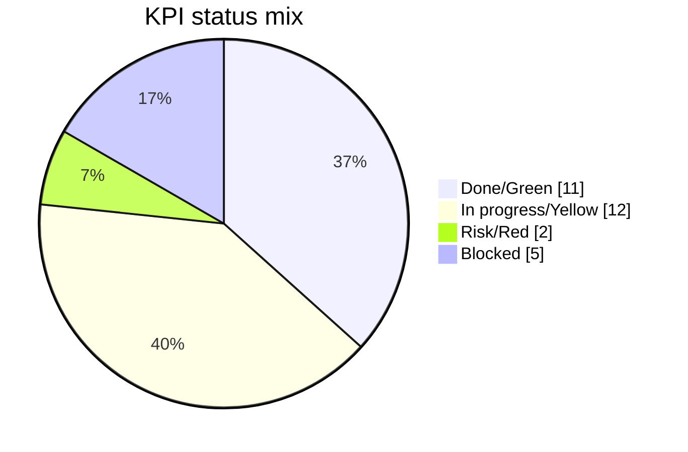
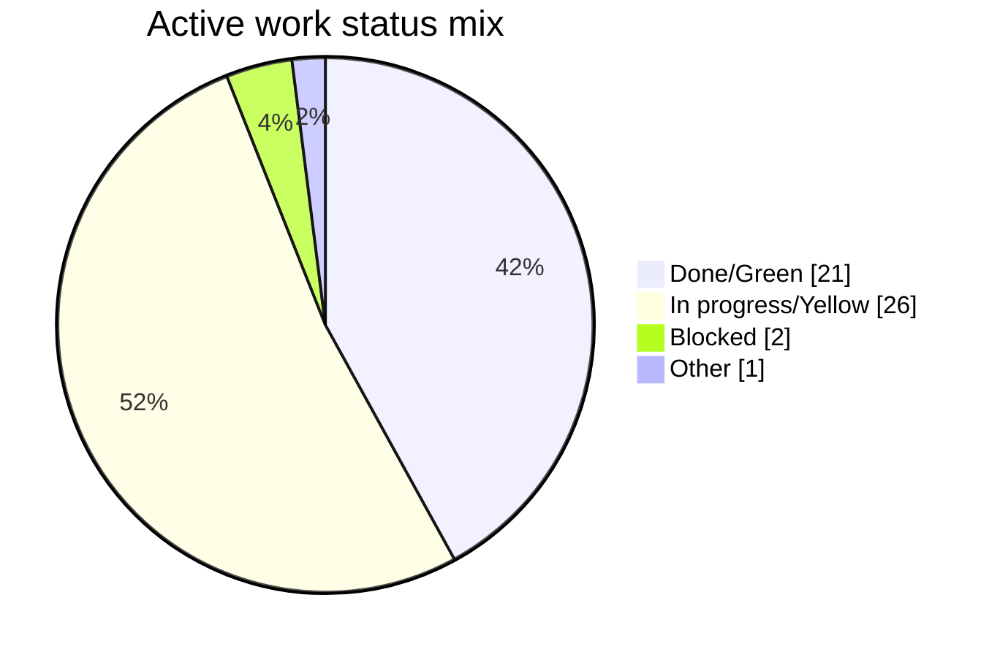
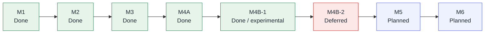
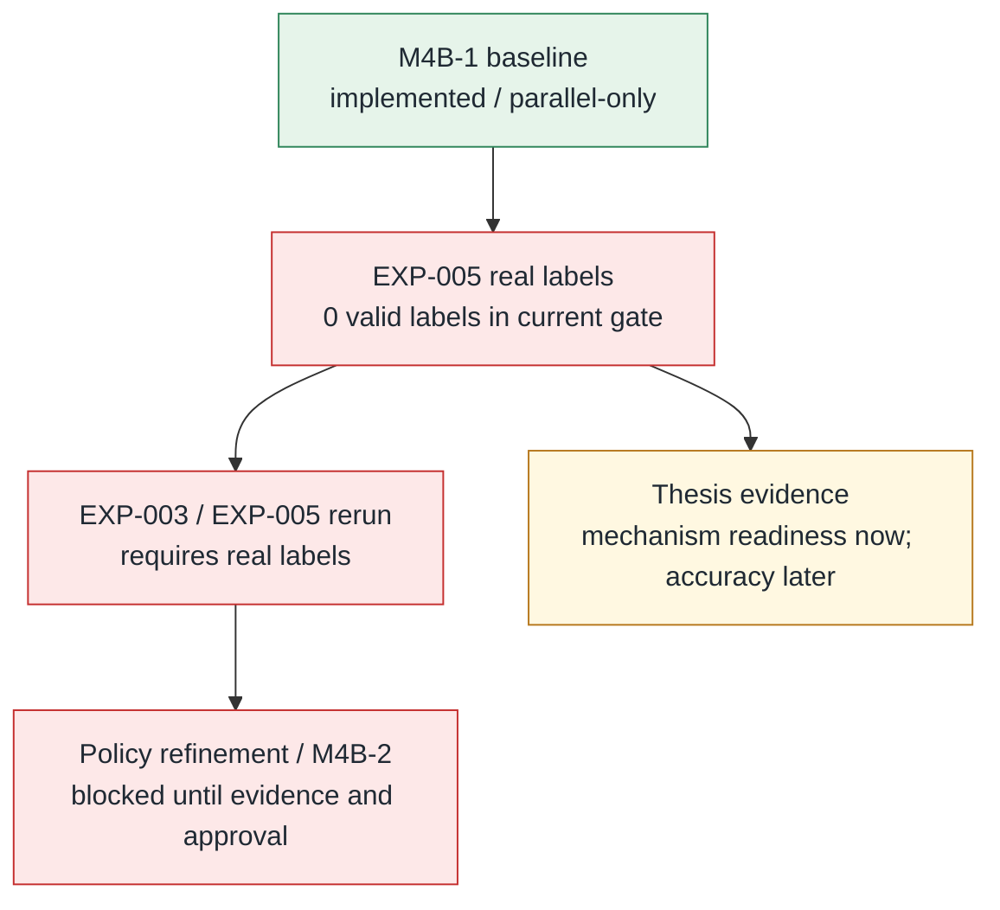

# Progress Visualizations

Generated: 2026-08-10 19:00 +03:00.

This generated dashboard summarizes docs/agent-memory/progress.md, docs/dashboards/progress-dashboard.md, and docs/dashboards/kpi-register.md. Regenerate it with .\scripts\build-progress-visualizations.ps1.

## Summary Cards

| Signal | Value | Visual |
| --- | --- | --- |
| Milestone completion | 74 of 84 done/green | [##################--] 88% |
| KPI green rate | 11 of 30 green | [#######-------------] 37% |
| Active work closed | 21 of 50 done | [########------------] 42% |
| Executive snapshot green | 6 of 22 green | [#####---------------] 27% |

## KPI Status Mix

## Active Work Status Mix

## Milestone Timeline

## Evidence Gate Flow

## EXP-005 Gate

> Current generated verdict is blocked: 27 rows, 24 safe candidates, 0 supplied labels, 0 valid labels, 0 safe labels.

## Open Active Work

| ID | Status | Summary | Next Step |
| --- | --- | --- | --- |
| TASK-003 | Open | Audit data sensitivity and provenance. | Review `VEGO-AI/inputs/`, `VEGO-AI/models/`, `VEGO-AI/analysis/`, and the IRB-related PDF. |
| TASK-004 | In progress | Map existing paper/package results to experiments. | Continue `EXP-000-existing-packaged-results-audit` without copying controlled artifacts into Git. |
| TASK-005 | Blocked | Keep curated Confluence wiki current. | Grant Atlassian Rovo access to cloud `724252a1-a5b7-45a5-b6ec-27a8292197ec`, then create/update child pages and store page IDs in local config. |
| TASK-008 | Open | Keep progress, KPI, and results dashboards current. | Update `docs/dashboards/` whenever progress, KPI values, validated results, or Confluence tracking status changes. |
| TASK-009 | Open | Keep dashboard/wiki tracking health verified. | Run `.\scripts\dashboard-health.ps1 -RequireOutbox` after every Confluence outbox build. |
| TASK-010 | Open | Keep runtime dashboard snapshot fresh. | Run `.\scripts\build-confluence-wiki.ps1` after memory/dashboard updates; it regenerates `docs/dashboards/status-snapshot.generated.md`. |
| TASK-011 | Open | Keep manual Confluence sync pack fresh while live access is blocked. | Run `.\scripts\build-confluence-wiki.ps1`; it regenerates `docs/confluence/manual-sync-pack.generated.md`. |
| TASK-013 | In review | Harden M4B nested schema requirements. | Review and merge PR #6. |
| TASK-016 | Open | Complete EXP-001 expert-label evaluation. | Add held-out/cross-setting expert labels, rerun `.\scripts\build-exp001-evaluation.ps1`, and update the evaluation report with generalization-safe metrics. |
| TASK-017 | Open | Fill EXP-002 expert labeling package. | Human/supervisor should label at least 20 rows, preferably all 27 current rows, then rerun evaluation with leakage-aware partitions. |

## Generated HTML

Open docs/dashboards/progress-visualizations.generated.html locally for the card-and-bar version.
