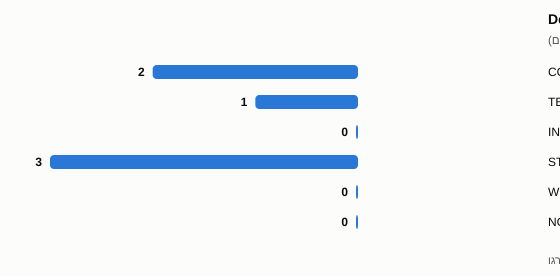
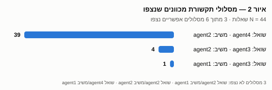
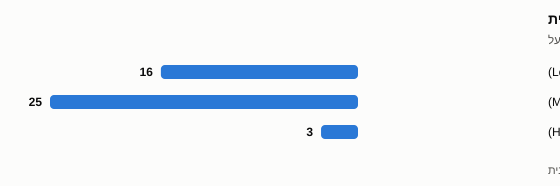
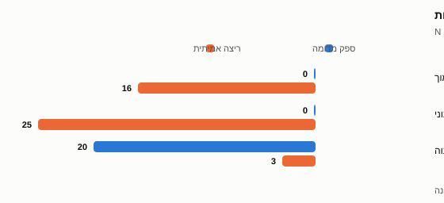

# מחקר 1 — AirTravel: תוצאות מקדימות תיאוריות

> **סטטוס קובע:** `PARTIAL_EVIDENCE_ONLY / DESCRIPTIVE_REPORTING_WITH_RETROSPECTIVE_PROVENANCE`
>
> הראיות הפרטיות אומתו בדיעבד; הקבלה המקורית לא קשרה בעצמה את גיבוב יומן האירועים, את סיכום מחזור-החיים או את גרסת קוד הביצוע. אלה פערי ייחוס — לא שגיאות ערך: כל מספר בדוח שוחזר מיומן האירועים. אישור מנחה **אינו** משדרג ריצה זו לייחוס פרוספקטיבי או רשום-מראש.

**סטטוס: תוצאה תיאורית תקפה** · ריצת ספק מאושרת אחת · ‏N=4 מקרים · 3 אפיזודות שלמות

> הנתונים הם קורפוס ציבורי חיצוני שנוצר באמצעות מודלי שפה; הם אינם נתוני סטודנטים ואינם שחזור של Cheers/ParkWise.

## 1. מטרת מחקר 1

לבחון היתכנות תיאורית: האם ניתן ללכוד תקשורת שאלות–תשובות בין סוכני VEGO-AI מקצה לקצה, ולסווג אותה לפי כלל שהוגדר והוקפא מראש. אין זו הערכת ביצועים ואין זו בדיקת תועלת.

## 2. מקור הנתונים וסיווגם

| פריט | ערך |
|---|---|
| מזהה הגדרה | `cd_airtravel` |
| מזהה קורפוס | `text2uml_airtravel_253b26dc` |
| מספר מקרים זמינים (N) | 4 |
| סיווג | `PUBLIC_EXTERNAL` + `EXTERNAL_LLM_GENERATED` |
| אימות מקור | 143/143 קבצים; 5/5 קובצי ריצה מאומתים ברמת הבית |
| ארכיון ריצה | `e37baecd…35fdd31f` |

*‏[ייחוס בדיעבד — ראו הסייג הקובע בראש המסמך]*

הנתונים אינם נתוני סטודנטים, אינם נתונים היסטוריים של Cheers/ParkWise, אינם שחזור ואינם מילוי-פער סינתטי. לא נוצר אף מקרה סינתטי.

## 3. תצורת ההרצה — הוקפאה לפני כל תצפית

| פרמטר | ערך |
|---|---|
| ספק ומודל | OpenAI · `gpt-5.6-luna` |
| ממשק | `chat.completions` |
| תקרת אסימוני פלט | 16,384 |
| טמפרטורה | ברירת המחדל של המודל (לא נדרסה) |
| פסק זמן בקשה / ריצה | 180 / 3,600 שניות |
| ניסיונות חוזרים | עד 3 לקריאה, נספרים בתקרה |
| מקביליות | 2 מקרים |
| `MAX_QA_ROUNDS` | 10 |
| גבולות קריאות | מינימום 4+3N = 16 · מרבי 82+61N = 326 |
| תקרת עלות | 10 דולר, עצירה קשיחה עם הזמנה מוקדמת לכל בקשה |

*‏[ייחוס בדיעבד — ראו הסייג הקובע בראש המסמך]*

## 4. טבלת תוצאות מרכזית

| מדד | ערך |
|---|---|
| מקרים זמינים | 4 |
| אפיזודות Q&A שנצפו | 3 |
| אפיזודות שלמות (מכנה מדעי) | **3** |
| `CONVERGED` | 2 |
| `TERMINATED_MAX_ROUNDS` | 1 |
| `INCOMPLETE_TECHNICAL` | **0** |
| שאלות | 44 |
| תשובות | 44 |
| סבב מרבי שנצפה | 10 |
| מסלולים מכוונים שנצפו | 3 (מתוך 6 אפשריים) |

*‏[ייחוס בדיעבד — ראו הסייג הקובע בראש המסמך]*

**כיסוי המקרים.** שתי אפיזודות משויכות למקרים `02` ו-`03` (‏agent3, שלב `case_inspection`). האפיזודה השלישית היא של `agent4` בשלב `variability_classification` ואינה משויכת למקרה בודד — היא חוצת-מקרים לפי מבנה הצנרת. **מקרים `01` ו-`04` לא ייצרו אף אפיזודת Q&A.** היעדר אפיזודה אינו כשל טכני: הצנרת עיבדה את ארבעת המקרים, ובאותם שני מקרים לא נוצרו שאלות לייעוץ.

*איור 3 — **מה נמדד:** שני מדדים נפרדים המוצגים על אותן אפיזודות — מצב מחזור-החיים של האפיזודה, וסיווג Detector-v1. **מונה:** מצב מחזור-החיים — `CONVERGED` 2 · `TERMINATED_MAX_ROUNDS` 1 · `INCOMPLETE_TECHNICAL` 0; סיווג Detector-v1 — `STRONG_ALERT` 3 · `WEAK_ALERT` 0 · `NO_ALERT` 0. **מכנה:** 3 אפיזודות שלמות; אפס אפיזודות הוחרגו. **מקור:** ‏`output/qa_events.jsonl`, sha256 ‏`55ea9361…d117cac4`. **מה אינו מוכיח:** התרעה פירושה מועמדות לבדיקה אנושית ואין היא שגיאה שאותרה; שש העמודות הן שני מדדים שונים זה מזה, ואין לקרוא אותן כסדרה אחת.*

*‏[ייחוס בדיעבד — ראו הסייג הקובע בראש המסמך]*

## 5. טבלת מסלולי תקשורת

| סוכן שואל | סוכן משיב | מספר שאלות |
|---|---|---|
| agent4 | agent2 | 39 |
| agent3 | agent2 | 4 |
| agent3 | agent1 | 1 |
| **סה"כ** | — | **44** |

*‏[ייחוס בדיעבד — ראו הסייג הקובע בראש המסמך]*

שלושה מסלולים מכוונים לא נצפו כלל: שואל agent2 / משיב agent1 · שואל agent2 / משיב agent2 · שואל agent4 / משיב agent1.

*איור 2 — **מה נמדד:** מספר השאלות בכל זוג מסלול מכוון (סוכן שואל, סוכן משיב). **מונה:** 39 · 4 · 1. **מכנה:** 44 שאלות; 3 מתוך 6 זוגות המסלול האפשריים נצפו. **מקור:** ‏`output/qa_events.jsonl`, sha256 ‏`55ea9361…d117cac4`. **מה אינו מוכיח:** נפח התנועה במסלול אינו מעיד אם מסלול כלשהו היה מועיל, נחוץ או נבחר נכונה, וזוג מסלול שלא נצפה אינו זוג מסלול מושבת.*

*‏[ייחוס בדיעבד — ראו הסייג הקובע בראש המסמך]*

## 6. ביטחון תשובות וראיות

| רמת ביטחון | ספירה | אחוז מתוך 44 |
|---|---|---|
| נמוך (Low) | 16 | 36.4% |
| בינוני (Medium) | 25 | 56.8% |
| גבוה (High) | 3 | 6.8% |

*‏[ייחוס בדיעבד — ראו הסייג הקובע בראש המסמך]*

*איור 1 — **מה נמדד:** התפלגות רמות ביטחון התשובה כפי שדווחו על-ידי המודל עצמו. **מונה:** נמוך 16 · בינוני 25 · גבוה 3. **מכנה:** 44 תשובות ב-3 אפיזודות שלמות. **מקור:** ‏`output/qa_events.jsonl`, sha256 ‏`55ea9361…d117cac4`. **מה אינו מוכיח:** הביטחון מדווח על-ידי המודל עצמו, אינו אמת-מידה חיצונית, אינו מכויל, ואין הוא מעיד דבר על נכונותה של תשובה כלשהי.*

*‏[ייחוס בדיעבד — ראו הסייג הקובע בראש המסמך]*

הביטחון מדווח על-ידי המודל עצמו ואינו אמת-מידה חיצונית; אין להתייחס אליו כאל אמת קרקע.

**ראיות:** לכל 44 התשובות היה שדה ראיה באורך חיובי. ‏`S3` (ראיה חסרה: `null` או אורך אפס) פעל ב-**אפס** אפיזודות. נוכחות ראיה מעידה על קיום השדה בלבד — **לא** על איכות הראיה, נכונותה או רלוונטיותה. איכות הראיה לא נבדקה.

## 6א. שלוש שכבות נפרדות — ואין לערבב ביניהן

הריצה מייצרת שלושה סוגי מידע שונים זה מזה. ערבוב ביניהם הוא שגיאת פרשנות, ולכן הם מדווחים בנפרד:

| שכבה | מה היא | הערך בריצה זו | האם מזינה את Detector-v1 |
|---|---|---|---|
| (א) תוצאת המיפוי | שיפוט הצנרת על המודל המועמד מול קווי ההנחיה | **4 מתוך 4 מקרים `Satisfied`** · `partially_satisfied` 0 · `not_satisfied` 0 | **לא** |
| (ב) אות מצב השיחה | עובדות נצפות על מהלך השיחה: ביטחון התשובה, נוכחות שדה ראיה, מספר סבבים | ביטחון נמוך 16 · בינוני 25 · גבוה 3 · סבב מרבי 10 | **כן** — זהו הקלט היחיד |
| (ג) פעולה תפעולית | מועמדות לבדיקה אנושית, הנגזרת משכבה (ב) בלבד | 3 אפיזודות מועמדות | — התוצר |

*‏[ייחוס בדיעבד — ראו הסייג הקובע בראש המסמך]*

### תוצאת המיפוי — שכבה (א)

| מקרה | תוצאת מיפוי | `partially_satisfied` | `not_satisfied` |
|---|---|---|---|
| `01` | `Satisfied` | 0 | 0 |
| `02` | `Satisfied` | 0 | 0 |
| `03` | `Satisfied` | 0 | 0 |
| `04` | `Satisfied` | 0 | 0 |

*‏[ייחוס בדיעבד — ראו הסייג הקובע בראש המסמך]*

### תוויות הסטייה — שכבה (א), ואינן שגיאות

בריצה נמצאו **19 דפוסי מקטע חוזרים**: 14 בתווית `Alternative` ו-5 בתווית `Domain Mistake`. ‏`probe_confirmed` הוא `false` בכל 19 הדפוסים — כלומר אף תווית לא אוששה בבדיקה נוספת.

| תווית | דפוסים | סיווג שונות מקביל | ‏C2 (ביטחון) | ‏C3 (דגל עדכון הנחיות) |
|---|---|---|---|---|
| `Alternative` | 14 | `Substantial Variability` | גבוה 10 · בינוני 4 | כן |
| `Domain Mistake` | 5 | `Occasional Variability` | גבוה 5 | לא |

*‏[ייחוס בדיעבד — ראו הסייג הקובע בראש המסמך]*

‏`Alternative` פירושה **ניסוח חלופי תקף** שאינו מכוסה בקווי ההנחיה — ואין היא ליקוי, שגיאה או כשל. אף אחת מן התוויות אינה מפעילה התרעה ואינה משתתפת בסיווג Detector-v1. המכנה כאן הוא **19 דפוסי שונות**, ולא 3 אפיזודות ולא 4 מקרים; אין למזג בין המכנים.

## 7. טבלת אותות Detector-v1

**מהי "התרעה"?** ‏`STRONG_ALERT` פירושה **מועמדות לבדיקה אנושית** בלבד. היא נקבעת אך ורק מתנאי תקשורת נצפים — ביטחון תשובה נמוך (`S1`), היעדר שדה ראיה (`S3`) או סיום במגבלת הסבבים (`S7`). **אין** היא קובעת שהתרחשה שגיאה, שהמודל שגה, שהתוצר פגום או שנדרשה התערבות. היא מצביעה על שיחה שראוי שאדם יביט בה, ותו לא. נכונות ההתרעות אינה נבדקת כאן ואינה ניתנת לבדיקה מנתונים אלה.

מכנה: **3 אפיזודות שלמות**. אפס אפיזודות הוחרגו.

| סיווג | מספר אפיזודות |
|---|---|
| `STRONG_ALERT` | **3** |
| `WEAK_ALERT` | 0 |
| `NO_ALERT` | 0 |

*‏[ייחוס בדיעבד — ראו הסייג הקובע בראש המסמך]*

| אות | אפיזודות שבהן פעל |
|---|---|
| S1 — ביטחון תשובה נמוך | 3 |
| S3 — ראיה חסרה | 0 |
| S7 — סיום במגבלת הסבבים | 1 |
| S2 — ביטחון תשובה בינוני | 2 |
| S6 — יותר מסבב אחד | 2 |

*‏[ייחוס בדיעבד — ראו הסייג הקובע בראש המסמך]*

| אפיזודה | מקרה | סיום | שאלות | סבבים | אותות | סיווג |
|---|---|---|---|---|---|---|
| `EP-577319bf…` | 02 | `CONVERGED` | 1 | 1 | S1 | `STRONG_ALERT` |
| `EP-cefe8dd7…` | 03 | `CONVERGED` | 4 | 2 | S1, S2, S6 | `STRONG_ALERT` |
| `EP-81b2c98d…` | חוצה-מקרים | `TERMINATED_MAX_ROUNDS` | 39 | 10 | S1, S7, S2, S6 | `STRONG_ALERT` |

*‏[ייחוס בדיעבד — ראו הסייג הקובע בראש המסמך]*

**Detector-v1 לא הפריד בין האפיזודות לרמות התרעה בקורפוס קטן זה:** כל שלוש האפיזודות נפלו לאותה קטגוריה.

### משתני הקשר C1–C3

> **תיקון לדיווח קודם.** גרסה מוקדמת של מסמך זה דיווחה `C2` ו-`C3` כ-`NOT_AVAILABLE` וטענה שהם מזהי מקרי-פיילוט היסטוריים. **הקביעה שגויה ובוטלה.** שני המשתנים מוגדרים ברישום המוקדם, קיימים כשדות מאוכלסים בתוצר הריצה `output/variability_classifications.json`, וחושבו ממנו ישירות.

| משתנה | מקור | ערך בריצה | מכנה |
|---|---|---|---|
| C1 — `mapping_certainty < 0.7` | `reference_guidelines.json` | ערך יחיד `0.85` → **0 מופעים מתחת לסף** | 1 קו הנחיה |
| C2 — ביטחון סיווג agent4 (שדה `confidence`) | `variability_classifications.json` | גבוה 15 · בינוני 4 | **19 דפוסי שונות** |
| C3 — `flag_for_guidelines_update` | `variability_classifications.json` | כן 14 · לא 5 | **19 דפוסי שונות** |
| דגל הביקורת האנושית של המערכת עצמה — `requires_human_review` | `variability_classifications.json` | `false` בכל 19 | **19 דפוסי שונות** |

*‏[ייחוס בדיעבד — ראו הסייג הקובע בראש המסמך]*

שלושת משתני ההקשר מדווחים לצד התוצאה ואינם משתתפים בכלל הסיווג: ‏Detector-v1 נגזר אך ורק מ-`S1`/`S3`/`S7` ומ-`S2`/`S6`. מכניהם הוא 19 דפוסי שונות ואילו מכנה Detector-v1 הוא 3 אפיזודות; **אין למזג את המכנים ואין להשוות בין הסיווגים.**

> **תצפית הקשר — ואין להסיק ממנה מי צודק:** דגל הביקורת האנושית של המערכת עצמה (`requires_human_review`) הוא `false` בכל 19 סיווגי השונות, בעוד Detector-v1 סימן 3 מתוך 3 האפיזודות כמועמדות לבדיקה אנושית. **שני המדדים אינם אמת קרקע, אינם נמדדים על אותה יחידת ניתוח, ואינם מאששים או מפריכים זה את זה.** ההפרש מתועד כתצפית ואינו מתפרש.

## 8. טבלת עלות וקריאות

| פריט | בקשות מחויבות | אסימוני קלט | אסימוני פלט | עלות |
|---|---|---|---|---|
| ניסיון קודם 1 (נדחה בשער הפרמטרים) | 1 | 0 | 0 | 0.000000 דולר |
| ניסיון קודם 2 (נעצר בשכבת המכשור) | 3 | 10,285 | 6,863 | 0.010293 דולר |
| **ריצת החלופה שהתקבלה** | **43** | **186,558** | **81,384** | **0.134972 דולר** |
| **סה"כ עלות ספק** | **47** | 196,843 | 88,247 | **0.145265 דולר** |

*‏[ייחוס בדיעבד — ראו הסייג הקובע בראש המסמך]*

- **אסימונים בזיכרון מטמון:** `NOT_AVAILABLE` — שדה זה לא נאסף על-ידי מונה הריצה; לא ניתן לדווח עליו.
- **נוסחת מחיר:** ‏(קלט ÷ 1,000,000 × 0.20) + (פלט ÷ 1,000,000 × 1.20).
- **מקור רשמי:** תמחור OpenAI כפי שנקרא ב-2026-09-05 מ-`developers.openai.com/api/docs/pricing` (‏`gpt-5.6-luna`: 0.20 דולר קלט / 1.20 דולר פלט למיליון אסימונים).
- 43 מתוך 47 הבקשות המחויבות שייכות לריצה שהתקבלה; 4 שייכות לניסיונות שנכשלו ואינן משמשות לתוצאה כלשהי.
- כל 47 הבקשות בתוך תקרת 326 ובתוך תקרת 10 דולר.

## 9. סטיית פרוטוקול — דיווח שקוף

ריצת ספק מוקדמת יותר חשפה **פגם בשכבת המכשור**, לא במודל ולא בקורפוס: המשקיף דרש התאמה מדויקת בין מזהי השאלות שנשלחו למזהי התשובות שחזרו, ועצר את כל הריצה כאשר מודל אמיתי לא סיפק התאמה כזו.

**מה תוקן:** אי-התאמה במזהי תשובות נרשמת כעת כאפיזודה `INCOMPLETE_TECHNICAL`, מוחרגת מכל מכנה מדעי, והצנרת ממשיכה במקום להיעצר.

**האם ההסתעפות שתוקנה פעלה בריצה שהתקבלה?** לא. בריצה שהתקבלה נצפו אפס אפיזודות `INCOMPLETE_TECHNICAL`, וכל 44 התשובות התאימו למזהי השאלות ללא כפילות, ללא מזהה לא-מוכר וללא חוסר.

**סיווג הריצה:** זוהי **ריצת חלופה תיאורית** לאחר תיקון הפגם — ולא ניסיון ראשון נקי. הניסיונות שנכשלו ועלותם מדווחים במלואם בסעיף 8.

**שושלת גרסאות:** הערך היחיד הקשור לראיות הוא `execution_code_sha` — ‏`efe686ac0b13c6e17695b816da7eb0cdd3eadcc1`. ‏`reporting_code_sha` הוא **חותמת הפקת מסמך בלבד**: הוא מתקדם עם כל commit תיעודי ואינו חלק משרשרת הראיות, ולפיכך לא מצוטט כאן ערך קבוע עבורו — כל ערך שנרשם במסמך שהופק במועד קודם מתיישן ביחס לעץ הנוכחי ואין לו משמעות ראייתית. ההפרש בין עץ הביצוע לעץ הדיווח נבדק קובץ-אחר-קובץ: כל קובצי הביצוע (`airtravel_v4_execution.py`, `airtravel_v4_contract.py`, `airtravel_local_observer.py`, `airtravel_real_run.py`, `extract_qa_escalation_features.py`) **זהים ברמת הבית**. השינויים שלאחר הריצה הם **תיעוד בלבד** בתוספת סקריפט הניתוח.

## 10. בדיקת מכשור: ספק מדומה מול ריצה אמיתית

> **בדיקת הנדסה בלבד — אינה תוצאה מדעית — אינה מדד ביצועים של הספק — אינה השוואת `VEGO_AI_ON` מול `VEGO_AI_OFF`.**

אותה צנרת, אותו קורפוס, אותה תצורה; רק הספק שונה. מטרת ההשוואה היא לוודא שהמכשור מודד שינוי כאשר הקלט משתנה — ולא להעריך איכות, נכונות או תועלת. **שני המכנים נפרדים (20 תשובות מול 44) ואין למזג אותם.**

| מדד | ספק מדומה | ריצה אמיתית |
|---|---|---|
| קריאות | 46 (בשני מעברים) | 43 |
| עלות | 0 דולר | 0.134972 דולר |
| אפיזודות | 10 | 3 |
| שאלות / תשובות | 20 / 20 | 44 / 44 |
| סבב מרבי | 1 | **10** |
| `CONVERGED` / `MAX_ROUNDS` | 10 / 0 | 2 / **1** |
| ביטחון נמוך / בינוני / גבוה | 0 / 0 / 20 | **16 / 25 / 3** |

*‏[ייחוס בדיעבד — ראו הסייג הקובע בראש המסמך]*

*איור 4 — **מה נמדד:** התפלגות רמות ביטחון התשובות בשני מהלכי הרצה של אותה צנרת, כבדיקת מכשור בלבד. **מונה:** מספר התשובות בכל רמת ביטחון. **מכנה:** 20 תשובות בפיקסצ'ר · 44 תשובות בריצה האמיתית — **מכנים נפרדים, אין למזג**. **מקור:** ‏`analysis/baseline-comparison.json` ושני יומני האירועים. **מה אינו מוכיח:** אינו מוכיח איכות, נכונות, תועלת או עדיפות של צד כלשהו, ואינו מדד ביצועים של הספק.*

*‏[ייחוס בדיעבד — ראו הסייג הקובע בראש המסמך]*

הספק המדומה מחזיר תמיד ביטחון גבוה ומתכנס בסבב אחד — משום שכך נבנה מראש; המודל האמיתי מייצר ברובו ביטחון נמוך ובינוני ושרשראות ארוכות עד מיצוי עשרת הסבבים. ‏Detector-v1 **לא** הופעל על הבסיס המדומה — תשובות הפיקסצ'ר סינתטיות וחסרות משמעות מדעית.

## 11. פירוש מדעי מוגבל

- אפיזודה אחת הגיעה ל-`MAX_QA_ROUNDS`. זהו **תנאי תקשורת נצפה** — עובדה על מהלך השיחה, ולא הוכחה שנדרשה התערבות.
- שלוש התרעות חזקות מתוך שלוש הן **דפוס אותות תיאורי בלבד**, שנשלט כאן על-ידי ביטחון תשובה נמוך.
- **לא ניתן להסיק דבר** על השאלה האם התערבות אנושית הייתה נכונה, מועילה או נחוצה באיזו מהאפיזודות.

*‏[ייחוס בדיעבד — ראו הסייג הקובע בראש המסמך]*

## 12. מה הוכח ומה לא הוכח

| הוכח | לא הוכח |
|---|---|
| ניתן ללכוד תקשורת בין-סוכנית מקצה לקצה ולשמר אותה כראיה | שההתרעות נכונות |
| ניתן להחיל כלל סיווג קפוא על אפיזודות שלמות | שההתרעות מועילות או משפרות תוצאה |
| הצנרת רצה על קורפוס חיצוני אמיתי בעלות 0.13 דולר | שהממצא מייצג אוכלוסייה כלשהי |
| **בדיקת הנדסה בלבד:** המכשור מבחין בין מהלך פיקסצ'ר קבוע לבין מהלך של מודל אמיתי — בדיקת שפיות של המכשור, **לא** תוצאה מדעית ולא מדד איכות | שניתן להכליל למקרים, מודלים או תחומים אחרים |
| הסף אינו מפריד בקורפוס זה | מה הסף הנכון |
| תוצאת המיפוי בריצה זו היא 4 מתוך 4 `Satisfied` | שתוצאת המיפוי נכונה — היא שיפוט המערכת ולא אמת קרקע |

*‏[ייחוס בדיעבד — ראו הסייג הקובע בראש המסמך]*

## 13. מגבלות

- ‏N=4 מקרים, מכנה של 3 אפיזודות: כל שינוי בודד משנה כל יחס.
- שני מקרים מתוך ארבעה לא ייצרו אפיזודת Q&A כלל.
- אין תוויות אמת; נכונות ההתרעות לא נבדקה ואינה ניתנת לבדיקה מנתונים אלה.
- ריצה אחת, מודל אחד, הגדרה אחת — אין בסיס להכללה.
- ביטחון התשובות מדווח על-ידי המודל ואינו מדד חיצוני.
- נוכחות ראיה נמדדה; איכות ראיה לא נמדדה.
- הנתונים נוצרו במודלי שפה ואינם משקפים התנהגות סטודנטים.
- אישור מנחה עבור AirTravel אינו מתועד.
- זוהי ריצת חלופה לאחר תיקון פגם מכשור (סעיף 9).

*‏[ייחוס בדיעבד — ראו הסייג הקובע בראש המסמך]*

## 14. מסקנה לסיכום

במחקר היתכנות תיאורי על ארבעה מקרי AirTravel ציבוריים וחיצוניים, התקבלו שלוש אפיזודות Q&A שלמות. שלוש האפיזודות סומנו על-ידי Detector-v1 כ**מועמדות לבדיקה אנושית**, על יסוד תנאי תקשורת נצפים בלבד — ביטחון תשובה נמוך בשלוש האפיזודות (`S1`) וסיום במגבלת הסבבים באפיזודה אחת (`S7`); ‏`S3` (היעדר שדה ראיה) לא פעל כלל. **אין בסימון זה קביעה שהתרחשה שגיאה**, שהמודל שגה, שהתוצר פגום או שנדרשה התערבות. הממצא מדגים שניתן ללכוד ולסווג תקשורת בין-סוכנית מקצה לקצה; הוא אינו מוכיח שהמועמדות לבדיקה אנושית נקבעה נכונה, שהיא מועילה, מייצגת או ניתנת להכללה.

*‏[ייחוס בדיעבד — ראו הסייג הקובע בראש המסמך]*

## 15. מחקר המשך מוצע — לא בוצע

הסעיף הבא הוא **הצעה בלבד**. הוא לא בוצע, אינו משפיע על התוצאה שלמעלה, ואינו מחליף אותה.

- קורפוס ציבורי-חיצוני נוסף, שייבחר **באופן בלתי תלוי** ובעל `corpus_id` שונה.
- כלל בחירה שיוקפא בכתב **לפני** ראיית נתונים כלשהם.
- מכנים נפרדים לחלוטין; **אין מיזוג** עם תוצאות AirTravel.
- מספר מקרים גדול יותר, כדי לבדוק האם הסף מפריד בכלל.
- אם תיבחן נכונות ההתרעות — נדרשת תוכנית תיוג בלתי תלויה, עם שופטים אנושיים ומדד הסכמה, שתוגדר מראש.
- ‏Detector-v1 יישאר קפוא; כל שינוי סף יוגדר כמחקר נפרד עם רישום מוקדם משלו.

