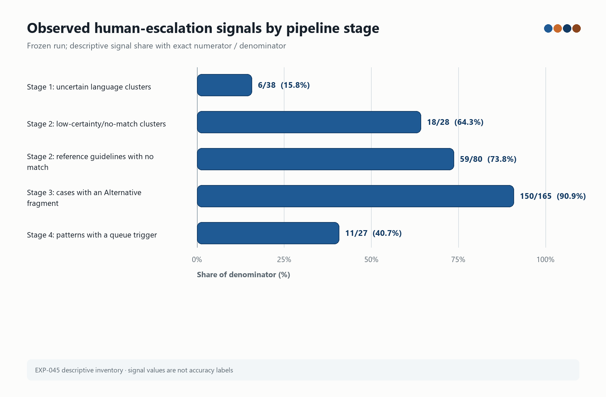
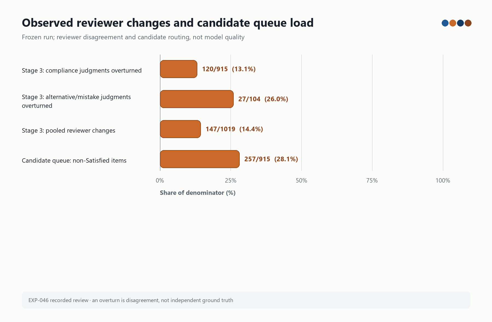

# VEGO-AI — Supervisor Readout: Human-Escalation Baseline and Study 2A Preparation

**Audience:** Prof. Iris Reinhartz-Berger and Prof. Arnon 
**Date:** 6 September 2026
**Status:** `PREPARATION_COMPLETE — AWAITING EXPLICIT RUN AUTHORIZATION`

> **Evidence boundary.** This readout reports the verified descriptive evidence already present in the
> frozen VEGO-AI run and the verified preparation work for the separate Study 2A comparison. It does not
> invent model outputs, relabel engineering fixtures as scientific data, or claim that one condition is better.
> No provider/API call, paid run, Detector-v1 experimental run, or new scientific experiment was executed for
> this readout.

## 1. What can be shown tomorrow

There are two defensible baselines:

1. **Observed descriptive baseline (existing frozen run).** The preserved VEGO-AI run contains 179 student
   model cases, 27 recurring variability patterns, and four settings. Existing reviewer records and the
   escalation inventory show where a human could have been asked and where reviewers changed a verdict.
2. **Prepared paired baseline (Study 2A).** `VEGO_AI_OFF` is a newly constructed, single-model, one-call
   baseline. `VEGO_AI_ON` is the full four-agent VEGO-AI orchestration. They are preregistered to use the
   same four-case public AirTravel corpus, model configuration, output schema, limits, and privacy policy.
   The paired provider outputs do not yet exist.

The first baseline answers **where/when human review could enter the current pipeline**. It does not answer
whether intervention improves accuracy, effort, or human outcomes.

## 2. Existing descriptive results: when a human could be asked

These numbers come from the read-only EXP-045 inventory over the frozen course run. They are signal counts,
not error labels.

| Pipeline stage | Observable signal | Result | Operational meaning |
|---|---|---:|---|
| Stage 1 — language advisor | Low-confidence or unassigned clusters | 6 / 38 clusters | Candidate checkpoint when language mapping is uncertain |
| Stage 1 — language advisor | Base constructs not reached | 7 / 40 constructs | Candidate checkpoint for missing language coverage |
| Stage 2 — domain advisor | Low-certainty or no-match domain clusters | 18 / 28 clusters | Strong candidate for domain-expert review |
| Stage 2 — domain advisor | Open questions to language advisor | 12 / 119 guidelines | Candidate clarification before downstream inspection |
| Stage 2 — domain advisor | Reference guidelines with no Agent 2 match | 59 / 80 guidelines | Largest recorded reference disagreement signal |
| Stage 3 — model inspector | Case files containing an `Alternative` fragment | 150 / 165 cases | High-volume ambiguity signal requiring triage, not automatic escalation of every case |
| Stage 3 — model inspector | `Alternative` fragments | 491 fragments | Candidate inspection points; no independent correctness label |
| Stage 3 — model inspector | High-severity mistakes | 15 / 165 cases | Candidate high-risk review points; the word “mistake” is the system label, not ground truth |
| Stage 4 — variability explorer | Patterns with a queue trigger | 11 / 27 patterns | The only stage that currently creates a human-review queue |

The Stage 4 triggers were `guideline_update_proposed` on 9 items and `medium_confidence` on 3 items (one
item carried both). The current hook therefore catches downstream variability patterns but does not catch the
Stage 2 reference disagreement signal. The evidence supports measuring Stage 2 versus Stage 3 versus Stage 4;
it does not select a “best” stage.

**How to read this plot.** Each horizontal bar is a descriptive signal share for its own denominator; the
printed numerator and denominator are the authoritative values. The visual makes the concentration of Stage 2
and Stage 3 signals easy to compare, while the caption prevents the percentages from being read as accuracy.
Source: EXP-045 frozen-run inventory.

## 3. Existing recorded-review baseline

EXP-046 re-analyzed the delivered co-author assessment record that accompanies the frozen run. It is useful
for locating intervention opportunities, but it is not independent ground truth and it is not a random sample.

| Measure | Observed value | Correct interpretation |
|---|---:|---|
| Stage 2 agent-written guidelines not fully accepted | 68 / 169 (40%) | Reviewers disagreed with the full guideline verdict; 17 additional required guidelines were absent |
| Reference requirements without a matched Agent 2 guideline | 59 / 78 | Coverage gap in the recorded reference mapping |
| Stage 3 compliance judgments overturned by reviewers | 120 / 915 (13%) | A reviewer changed the recorded verdict; not proof that the agent was wrong |
| Stage 3 alternative-or-mistake judgments overturned | 27 / 104 (26%) | Same limitation: disagreement, not ground truth |
| Pooled Stage 3 overturns | 147 / 1,019 | Descriptive reviewer-change count |
| Items flagged by “not Satisfied” rule | 257 / 915 (28%) | A candidate queue rule |
| Overturns covered by that rule | 108 / 120 (90%) | Retrospective association in this reviewed sample; no threshold was fitted |
| Stage 4 patterns queued | 11 / 27 | Existing queue output |
| Agent score vs. course grade | r = 0.25 over 164 rows | Different measures; not an accuracy estimate |

The practical message for tomorrow is: **the inspector’s own non-`Satisfied` signal is a measurable candidate
for selective review, while the domain-guideline and variability stages need a controlled comparison rather than
an assumption that one is preferable.**

**How to read this plot.** The bars show recorded reviewer changes alongside one candidate queue rule, with the
denominator printed beside every value. An overturn is a reviewer disagreement in this record, not an independent
ground-truth label; the plot therefore supports queue design, not a quality claim. Source: EXP-046 recorded review.

## 4. Frozen C0 operating baseline

| Dimension | Value |
|---|---:|
| Student-model cases | 179 |
| Recurring patterns | 27 |
| Domains | Cheers and ParkWise (2) |
| Diagram types | Use-case and class (2) |
| Settings | `ucd_ch`, `ucd_pw`, `cd_ch`, `cd_pw` |
| M1 human-review queue | 11 / 27 patterns |
| M4B-1 classification changes | 0 / 27 |
| Generalization-safe independent expert labels | 0 / 24 candidates |

The 0/27 change count demonstrates the conservative, non-destructive behavior of the existing memory-informed
policy. It is not an improvement result. EXP-005 remains at 0/24 safe labels, so accuracy, generalization,
human benefit, and superiority remain unevaluable.

## 5. Study 2A: the prepared paired baseline

| Property | `VEGO_AI_ON` | `VEGO_AI_OFF` |
|---|---|---|
| Purpose | Full VEGO-AI orchestration | Explicit single-model no-VEGO baseline |
| Call structure | Four-agent orchestration with Q&A/lifecycle/Detector contract | One direct model call per case; no delegation, Q&A, feedback, or Detector input |
| Corpus | `cd_airtravel` / `text2uml_airtravel_253b26dc` | Identical |
| Cases | `01`, `02`, `03`, `04` (`N=4`) | Identical |
| Model configuration | `openai` / `gpt-5.6-luna`, temperature 0, top-p 1, seed 20260906 | Identical |
| Output contract | `structured_uml_review_v1`, strict validation | Identical |
| Execution state | Disabled; network forbidden | Disabled; network forbidden |
| Scientific result | Not observed | Not observed |

The baseline selection is explicit: repository search found no valid historical non-VEGO AirTravel baseline,
so `BASELINE_SINGLE_MODEL_NO_VEGO` is a newly constructed experimental comparator, not a recovered result.
The machine manifest is [`study2-vego-ai-on-off-manifest.json`](./study2-vego-ai-on-off-manifest.json), with
canonical LF SHA-256
`4f6e627c6c8ab41baf37a40720b20b333b4b60efa6fe1bdad9fa8b3afcb63b62`.

## 6. What was actually verified in preparation

The following are engineering/readiness results, not AirTravel model outcomes:

| Check | Result |
|---|---:|
| Study 2A targeted contract tests | 32 passed |
| Complete scripts suite | 389 passed, 22 skipped, 7 subtests; 2 warnings |
| Root tests | 46 passed |
| `VEGO-AI/tests` | 134 passed |
| Ruff on changed files | PASS |
| Python compilation of changed code | PASS |
| Privacy scan | PASS |
| Security history audit | PASS |
| Evidence consistency | PASS (3/3 present checks; controlled report absent is explicitly skipped) |
| Hardening-manifest check | PASS |
| Dashboard health | PASS |
| CI run `34000970567` | All six jobs green |

The deterministic fixture path accepted four hashed-only engineering cases for each condition, produced four
event IDs per condition, kept the ID sets disjoint, and recorded `provider_calls=0` and
`external_network_calls=0`. It is an instrumentation check only; it contains no AirTravel content and must not
be shown as a scientific result.

The protected runtime files, Detector-v1, and Study 1 artifacts were not modified. The separate Study 2B Llama
feasibility note remains a feasibility track and is not pooled with this comparison.

## 7. Measures that the real paired run will produce

After a separate explicit authorization, the same denominators will be used for both conditions. The run will
record attempted/completed cases, technical failures, schema validity, parsing, elapsed time, calls, tokens,
cost, retries, completion state, and artifact counts. ON will additionally record episodes, questions, answers,
rounds, route pairs, termination states, confidence/evidence fields, and Detector-v1 signal tiers. OFF will
report Detector-v1 as `NOT_APPLICABLE`, not as zero alerts.

The declared call controls are **ON minimum `4 + 3N` (16 at N=4), ON maximum `82 + 61N` (326 at N=4), and
OFF exactly `N` (4 at N=4)**. Cost is `NOT_MEASURED_PREPARATION` until provider usage is separately measured.

## 8. Statements that must not be made tomorrow

Do not call the fixture an experiment or report it as a model result. Do not claim accuracy, correctness,
precision, recall, F1, human benefit, intervention effectiveness, superiority, generalization, or a result about
students. Do not report a real token cost or provider latency. The existing reviewer overturns are disagreements,
not proof of model error. The 59/80 and 150/165 counts are signals and coverage observations, not labels.

## 9. Suggested 60-second supervisor script

> “We froze a descriptive baseline on the existing run: 179 cases and 27 patterns. The signal inventory shows
> the earliest concentration at the domain-advisor stage—59 of 80 recorded reference guidelines had no match—
> while the inspector produced a high-volume ambiguity signal and the current queue only fires at Stage 4 on
> 11 of 27 patterns. In the recorded co-author review, a simple non-`Satisfied` rule would have placed 28% of
> inspector items in a review queue and covered 90% of the recorded changes, but those are disagreements, not
> ground truth. We therefore prepared a preregistered ON/OFF comparison on the same four-case AirTravel corpus.
> The engineering and privacy gates are green; no provider call has been made, so quality and human-benefit
> results are intentionally not claimed yet.”

## 10. Source map and next decision

- EXP-045 method and signal table: [`EXP-045 README`](../../../experiments/EXP-045-escalation-point-demonstration/README.md)
- EXP-046 recorded-review analysis: [`EXP-046 README`](../../../experiments/EXP-046-recorded-review-analysis/README.md)
- C0 operating profile: [`baseline-characterization.md`](../baseline-characterization.md)
- Study 2A preregistration: [`2026-09-06-study2-vego-ai-on-off-preregistration-he.md`](./2026-09-06-study2-vego-ai-on-off-preregistration-he.md)
- Study 2A technical readiness: [`2026-09-06-study2-vego-ai-on-off-technical-readiness-he.md`](./2026-09-06-study2-vego-ai-on-off-technical-readiness-he.md)
- Machine manifest: [`study2-vego-ai-on-off-manifest.json`](./study2-vego-ai-on-off-manifest.json)
- Plot data and figure receipt: [`2026-09-06-tomorrow-baseline-plot-data.json`](./2026-09-06-tomorrow-baseline-plot-data.json) and [`2026-09-06-tomorrow-baseline-figure-receipt.json`](./2026-09-06-tomorrow-baseline-figure-receipt.json)
- Reproducible plot generator: [`plot_supervisor_baseline.py`](../../../scripts/plot_supervisor_baseline.py)
- Draft implementation PR: [PR #40](https://github.com/AliHamed17/vego-ai-research/pull/40)
- Green CI: [run 34000970567](https://github.com/AliHamed17/vego-ai-research/actions/runs/34000970567)

**Decision requested:** review the evidence boundary and approve (or revise) the ON/OFF comparator and model/
budget settings before any provider-backed run. Until that decision is recorded, the scientifically correct
status remains `PREPARATION_COMPLETE — AWAITING EXPLICIT RUN AUTHORIZATION`.
